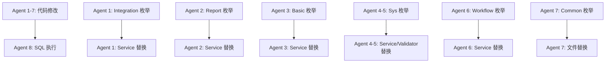

# 全后端模块异常国际化全面修复计划

## 一、现状统计

### 1.1 各模块 BusinessException 分布

| 模块 | Service 层 | Validator 层 | 其他 | 合计 | 已有枚举 | 已有 i18n |
|-----|-----------|-----------|-----|-----|---------|---------|
| **Forgex_Sys** | 42 | 30 | 0 | **72** | ✅ SysPromptEnum | ✅ 142 条 |
| **Forgex_Integration** | **76** | 0 | 0 | **76** | ❌ 无 | ❌ 无 |
| **Forgex_Workflow** | **78** | 0 | 0 | **78** | ✅ WorkflowPromptEnum | ✅ 21 条 |
| **Forgex_Report** | **15** | 0 | 0 | **15** | ❌ 无 | ❌ 无 |
| **Forgex_Basic** | **11** | 0 | 0 | **11** | ❌ 无 | ❌ 无 |
| **Forgex_Common** | 6 | 0 | 2 | **8** | ✅ 多个 Enum | ✅ 98 条 |
| **Forgex_Auth** | 0 | 0 | 0 | **0** | ✅ AuthPromptEnum | ✅ 18 条 |
| **Forgex_Job** | 0 | 0 | 0 | **0** | - | - |
| **总计** | **212** | **30** | **2** | **260** | - | - |

### 1.2 详细分布

#### Forgex_Sys 模块（72 处）

**Service 层（42 处）：**
- `SysMessageServiceImpl.java`：8 处（租户消息白名单、模板配置等）
- `SysRolePositionServiceImpl.java`：2 处（职位不存在）
- `SysEncodeRuleServiceImpl.java`：8 处（编码规则校验）
- `SysMessageTemplateServiceImpl.java`：10 处（消息模板校验）
- `SysUserRoleServiceImpl.java`：4 处（用户角色分配）

**Validator 层（30 处）：**
- `UserValidator.java`：9 处（用户校验：账号、邮箱、手机等）
- `RoleValidator.java`：11 处（角色校验：编码、名称、键等）
- `MenuValidator.java`：14 处（菜单校验：类型、权限标识等）
- `ModuleValidator.java`：10 处（模块校验：编码、名称等）
- `RoleMenuValidator.java`：4 处（角色菜单校验）

#### Forgex_Integration 模块（76 处）- **新增模块**

- `ApiConfigServiceImpl.java`：14 处（接口配置 CRUD）
- `ApiRouterServiceImpl.java`：5 处（API 路由）
- `ApiParamConfigServiceImpl.java`：21 处（参数配置）
- `ApiParamMappingServiceImpl.java`：19 处（参数映射）
- `ApiCallLogServiceImpl.java`：1 处（调用日志）
- `ThirdSystemServiceImpl.java`：10 处（第三方系统）
- `ThirdAuthorizationServiceImpl.java`：14 处（第三方授权）

#### Forgex_Workflow 模块（78 处）

- `WfTaskConfigServiceImpl.java`：49 处（任务配置）
- `WfExecutionServiceImpl.java`：23 处（审批执行）
- `WfEngineServiceImpl.java`：6 处（引擎）

#### Forgex_Report 模块（15 处）- **新增模块**

- `ReportTemplateServiceImpl.java`：8 处（报表模板）
- `ReportCategoryServiceImpl.java`：3 处（报表分类）
- `ReportDatasourceServiceImpl.java`：4 处（数据源）

#### Forgex_Basic 模块（11 处）- **新增模块**

- `MaterialServiceImpl.java`：5 处（物料管理）
- `MaterialExtendServiceImpl.java`：3 处（物料扩展）
- `MaterialExtendConfigServiceImpl.java`：5 处（扩展配置）

#### Forgex_Common 模块（8 处）

- `MessageSenderService.java`：3 处（消息发送）
- `MessageSenderUtil.java`：1 处（工具类）
- `TemplateMessageSenderImpl.java`：1 处（模板消息）
- `TemplateOptionProviderRegistry.java`：2 处（Excel 选项）
- `AutoFillUsernameAspect.java`：3 处（自动填充切面）

## 二、修复方案

### 2.1 总体策略

1. **新增 PromptEnum**：为 Integration、Report、Basic 模块创建新的 PromptEnum
2. **补充现有 Enum**：为 Sys、Workflow、Common 模块的 PromptEnum 添加缺失枚举项
3. **更新 fx_i18n_message 表**：为所有新增枚举插入 5 种语言的国际化文案
4. **替换异常抛出**：将所有 `BusinessException("中文")` 改为 `I18nBusinessException`

### 2.2 需要新增的 PromptEnum

#### 2.2.1 IntegrationPromptEnum（76 个枚举项）

```java
package com.forgex.integration.enums;

@Getter
public enum IntegrationPromptEnum implements I18nPrompt {
    // ========== API 配置 ==========
    API_CONFIG_NOT_FOUND("API_CONFIG_NOT_FOUND", "接口配置不存在"),
    API_CODE_EXISTS("API_CODE_EXISTS", "接口编码已存在：{0}"),
    API_CONFIG_CREATE_FAILED("API_CONFIG_CREATE_FAILED", "创建接口配置失败"),
    API_CONFIG_UPDATE_FAILED("API_CONFIG_UPDATE_FAILED", "更新接口配置失败"),
    API_CONFIG_DELETE_FAILED("API_CONFIG_DELETE_FAILED", "删除接口配置失败"),
    API_CONFIG_ENABLE_FAILED("API_CONFIG_ENABLE_FAILED", "启用接口配置失败"),
    API_CONFIG_DISABLE_FAILED("API_CONFIG_DISABLE_FAILED", "停用接口配置失败"),
    
    // ========== 参数配置 ==========
    PARAM_CONFIG_NOT_FOUND("PARAM_CONFIG_NOT_FOUND", "参数配置不存在"),
    PARAM_FIELD_NAME_REQUIRED("PARAM_FIELD_NAME_REQUIRED", "字段名称不能为空"),
    PARAM_NODE_TYPE_REQUIRED("PARAM_NODE_TYPE_REQUIRED", "节点类型不能为空"),
    PARAM_PARENT_NOT_FOUND("PARAM_PARENT_NOT_FOUND", "父节点不存在"),
    PARAM_CONFIG_CREATE_FAILED("PARAM_CONFIG_CREATE_FAILED", "创建参数配置失败"),
    PARAM_CONFIG_UPDATE_FAILED("PARAM_CONFIG_UPDATE_FAILED", "更新参数配置失败"),
    PARAM_CONFIG_DELETE_FAILED("PARAM_CONFIG_DELETE_FAILED", "删除参数配置失败"),
    PARAM_JSON_PARSE_FAILED("PARAM_JSON_PARSE_FAILED", "解析 JSON 失败：{0}"),
    
    // ========== 参数映射 ==========
    PARAM_MAPPING_NOT_FOUND("PARAM_MAPPING_NOT_FOUND", "参数映射不存在"),
    PARAM_SOURCE_FIELD_REQUIRED("PARAM_SOURCE_FIELD_REQUIRED", "源字段路径不能为空"),
    PARAM_TARGET_FIELD_REQUIRED("PARAM_TARGET_FIELD_REQUIRED", "目标字段路径不能为空"),
    PARAM_DIRECTION_REQUIRED("PARAM_DIRECTION_REQUIRED", "映射方向不能为空"),
    PARAM_MAPPING_EXISTS("PARAM_MAPPING_EXISTS", "映射关系已存在：源字段={0},目标字段={1}"),
    PARAM_MAPPING_CREATE_FAILED("PARAM_MAPPING_CREATE_FAILED", "创建参数映射失败"),
    PARAM_MAPPING_UPDATE_FAILED("PARAM_MAPPING_UPDATE_FAILED", "更新参数映射失败"),
    PARAM_MAPPING_DELETE_FAILED("PARAM_MAPPING_DELETE_FAILED", "删除参数映射失败"),
    
    // ========== API 路由 ==========
    API_HANDLER_NOT_CONFIGURED("API_HANDLER_NOT_CONFIGURED", "未配置接口处理器：{0}"),
    API_HANDLER_NULL("API_HANDLER_NULL", "处理器为空：{0}"),
    API_ROUTE_FAILED("API_ROUTE_FAILED", "路由处理器失败：{0}"),
    API_PARAM_CONVERT_FAILED("API_PARAM_CONVERT_FAILED", "参数转换失败：{0}"),
    
    // ========== 第三方系统 ==========
    THIRD_SYSTEM_NOT_FOUND("THIRD_SYSTEM_NOT_FOUND", "第三方系统不存在"),
    THIRD_SYSTEM_CODE_EXISTS("THIRD_SYSTEM_CODE_EXISTS", "系统编码已存在：{0}"),
    THIRD_SYSTEM_CREATE_FAILED("THIRD_SYSTEM_CREATE_FAILED", "创建第三方系统失败"),
    THIRD_SYSTEM_UPDATE_FAILED("THIRD_SYSTEM_UPDATE_FAILED", "更新第三方系统失败"),
    THIRD_SYSTEM_DELETE_FAILED("THIRD_SYSTEM_DELETE_FAILED", "删除第三方系统失败"),
    
    // ========== 第三方授权 ==========
    THIRD_AUTH_NOT_FOUND("THIRD_AUTH_NOT_FOUND", "第三方授权不存在"),
    THIRD_AUTH_EXISTS("THIRD_AUTH_EXISTS", "该第三方系统已存在授权配置"),
    THIRD_AUTH_CREATE_FAILED("THIRD_AUTH_CREATE_FAILED", "创建第三方授权失败"),
    THIRD_AUTH_UPDATE_FAILED("THIRD_AUTH_UPDATE_FAILED", "更新第三方授权失败"),
    THIRD_AUTH_DELETE_FAILED("THIRD_AUTH_DELETE_FAILED", "删除第三方授权失败"),
    THIRD_AUTH_NOT_CONFIGURED("THIRD_AUTH_NOT_CONFIGURED", "该第三方系统未配置授权信息"),
    THIRD_AUTH_NOT_TOKEN_TYPE("THIRD_AUTH_NOT_TOKEN_TYPE", "该系统的授权方式不是 TOKEN 方式"),
    THIRD_AUTH_WHITELIST_REQUIRED("THIRD_AUTH_WHITELIST_REQUIRED", "白名单授权方式必须配置白名单 IP 列表"),
    THIRD_AUTH_UNSUPPORTED_TYPE("THIRD_AUTH_UNSUPPORTED_TYPE", "不支持的授权方式：{0}"),
    
    // ========== 调用日志 ==========
    CALL_LOG_ID_REQUIRED("CALL_LOG_ID_REQUIRED", "调用记录 ID 不能为空"),
    
    // ========== 通用 ==========
    ID_REQUIRED("ID_REQUIRED", "ID 不能为空"),
    DELETE_IDS_REQUIRED("DELETE_IDS_REQUIRED", "删除 ID 列表不能为空"),
    TENANT_INFO_NOT_FOUND("TENANT_INFO_NOT_FOUND", "无法识别当前租户");
    
    @Override
    public String getModule() {
        return "integration";
    }
}
```

#### 2.2.2 ReportPromptEnum（15 个枚举项）

```java
package com.forgex.report.enums;

@Getter
public enum ReportPromptEnum implements I18nPrompt {
    // ========== 报表模板 ==========
    REPORT_TEMPLATE_NOT_FOUND("REPORT_TEMPLATE_NOT_FOUND", "报表模板不存在"),
    REPORT_TEMPLATE_CONTENT_EMPTY("REPORT_TEMPLATE_CONTENT_EMPTY", "模板内容为空"),
    REPORT_TEMPLATE_EXPORT_FAILED("REPORT_TEMPLATE_EXPORT_FAILED", "导出模板失败：{0}"),
    REPORT_TEMPLATE_IMPORT_FAILED("REPORT_TEMPLATE_IMPORT_FAILED", "导入模板失败：{0}"),
    REPORT_TEMPLATE_CODE_EXISTS("REPORT_TEMPLATE_CODE_EXISTS", "模板编码已存在"),
    
    // ========== 报表分类 ==========
    REPORT_CATEGORY_NOT_FOUND("REPORT_CATEGORY_NOT_FOUND", "报表分类不存在"),
    REPORT_CATEGORY_CODE_EXISTS("REPORT_CATEGORY_CODE_EXISTS", "分类编码已存在"),
    REPORT_CATEGORY_HAS_CHILDREN("REPORT_CATEGORY_HAS_CHILDREN", "存在子分类，无法删除"),
    
    // ========== 数据源 ==========
    REPORT_DATASOURCE_NOT_FOUND("REPORT_DATASOURCE_NOT_FOUND", "报表数据源不存在"),
    REPORT_DATASOURCE_CODE_EXISTS("REPORT_DATASOURCE_CODE_EXISTS", "数据源编码已存在"),
    REPORT_DATASOURCE_CONNECT_FAILED("REPORT_DATASOURCE_CONNECT_FAILED", "数据源连接失败：{0}");
    
    @Override
    public String getModule() {
        return "report";
    }
}
```

#### 2.2.3 BasicPromptEnum（11 个枚举项）

```java
package com.forgex.basic.enums;

@Getter
public enum BasicPromptEnum implements I18nPrompt {
    // ========== 物料管理 ==========
    MATERIAL_NOT_FOUND("MATERIAL_NOT_FOUND", "物料不存在"),
    MATERIAL_CODE_EXISTS("MATERIAL_CODE_EXISTS", "物料编码已存在"),
    
    // ========== 物料扩展 ==========
    MATERIAL_EXTEND_NOT_FOUND("MATERIAL_EXTEND_NOT_FOUND", "扩展信息不存在"),
    MODULE_CODE_REQUIRED("MODULE_CODE_REQUIRED", "模块编码不能为空"),
    
    // ========== 扩展配置 ==========
    MATERIAL_EXTEND_CONFIG_NOT_FOUND("MATERIAL_EXTEND_CONFIG_NOT_FOUND", "扩展配置不存在");
    
    @Override
    public String getModule() {
        return "basic";
    }
}
```

### 2.3 需要补充的枚举项

#### 2.3.1 SysPromptEnum 补充（约 40 个）

需要在现有 154 个枚举基础上，补充以下缺失项：

```java
// ========== 用户校验 ==========
USER_ACCOUNT_EMPTY("USER_ACCOUNT_EMPTY", "用户账号不能为空"),
USER_TENANT_ID_EMPTY("USER_TENANT_ID_EMPTY", "租户 ID 不能为空"),

// ========== 角色校验 ==========
ROLE_ID_INVALID("ROLE_ID_INVALID", "角色 ID 格式不正确"),
ROLE_CODE_IMMUTABLE("ROLE_CODE_IMMUTABLE", "角色编码不可修改"),

// ========== 菜单校验 ==========
MENU_TYPE_INVALID("MENU_TYPE_INVALID", "菜单类型不正确，只能是：catalog、menu、button"),
MENU_URL_INVALID("MENU_URL_INVALID", "外联 URL 格式不正确"),
MENU_PERM_KEY_INVALID("MENU_PERM_KEY_INVALID", "权限标识格式不正确，必须符合 {module}:{entity}:{action} 格式"),
MENU_ID_INVALID("MENU_ID_INVALID", "菜单 ID 格式不正确"),

// ========== 模块校验 ==========
MODULE_ID_INVALID("MODULE_ID_INVALID", "模块 ID 格式不正确"),
MODULE_CODE_INVALID("MODULE_CODE_INVALID", "模块编码格式不正确，只能包含字母、数字、下划线，长度 2-50"),

// ========== 角色菜单校验 ==========
ROLE_MENU_ID_INVALID("ROLE_MENU_ID_INVALID", "角色 ID 格式不正确"),
ROLE_TENANT_ID_INVALID("ROLE_TENANT_ID_INVALID", "租户 ID 格式不正确"),

// ========== 职位校验 ==========
POSITION_NOT_FOUND("POSITION_NOT_FOUND", "部分职位不存在"),

// ========== 编码规则 ==========
ENCODE_RULE_CODE_EMPTY("ENCODE_RULE_CODE_EMPTY", "规则代码不能为空"),
ENCODE_RULE_NOT_FOUND_OR_DISABLED("ENCODE_RULE_NOT_FOUND_OR_DISABLED", "编码规则不存在或已禁用：{0}"),
DELETE_IDS_REQUIRED("DELETE_IDS_REQUIRED", "删除的 ID 列表不能为空"),

// ========== 消息模板 ==========
MSG_TEMPLATE_CODE_EXISTS("MSG_TEMPLATE_CODE_EXISTS", "模板编号已存在"),
MSG_TEMPLATE_NOT_IN_SCOPE("MSG_TEMPLATE_NOT_IN_SCOPE", "消息模板不存在或不在当前配置范围"),
MSG_TEMPLATE_PULL_NOT_NEEDED("MSG_TEMPLATE_PULL_NOT_NEEDED", "公共租户无需执行拉取操作"),
MSG_RECEIVER_IDS_FORMAT_ERROR("MSG_RECEIVER_IDS_FORMAT_ERROR", "接收人 ID 列表格式错误"),

// ========== 用户角色 ==========
USER_NOT_FOUND("USER_NOT_FOUND", "用户不存在"),
USER_NOT_BOUND_TENANT("USER_NOT_BOUND_TENANT", "用户未绑定该租户，无法分配角色"),
ROLE_INVALID_OR_CROSS_TENANT("ROLE_INVALID_OR_CROSS_TENANT", "存在无效角色或跨租户角色"),

// ========== 消息发送 ==========
MSG_NO_PERMISSION("MSG_NO_PERMISSION", "无权向该租户发送消息，请联系管理员配置租户消息白名单"),
MSG_TEMPLATE_TEST_PARAM_REQUIRED("MSG_TEMPLATE_TEST_PARAM_REQUIRED", "请求参数不能为空");
```

#### 2.3.2 WorkflowPromptEnum 补充（约 78 个）

详见之前的计划文件，此处省略。

#### 2.3.3 CommonPromptEnum 补充（约 8 个）

```java
// MessagePromptEnum 补充
MSG_SEND_FAILED_WITH_ERROR("MSG_SEND_FAILED_WITH_ERROR", "发送消息失败：{0}"),
MSG_SEND_EXCEPTION("MSG_SEND_EXCEPTION", "发送消息异常：{0}"),
MSG_TEMPLATE_NOT_FOUND_OR_DISABLED("MSG_TEMPLATE_NOT_FOUND_OR_DISABLED", "消息模板不存在或已禁用：{0}"),

// ExcelPromptEnum 补充
EXCEL_OPTION_PROVIDER_NOT_FOUND("EXCEL_OPTION_PROVIDER_NOT_FOUND", "TemplateOptionProvider not found: {0}"),
EXCEL_GET_OPTION_FAILED("EXCEL_GET_OPTION_FAILED", "获取选项列表失败：{0}"),

// 新增 CommonPromptEnum（用于切面等通用场景）
USER_ID_FIELD_EMPTY("USER_ID_FIELD_EMPTY", "用户 ID 字段 {0} 不能为空"),
USER_ID_FIELD_NOT_FOUND("USER_ID_FIELD_NOT_FOUND", "找不到用户 ID 字段：{0}"),
USER_NOT_FOUND_BY_ID("USER_NOT_FOUND_BY_ID", "找不到用户 ID 为 {0} 的用户");
```

### 2.4 SQL 插入脚本

为所有新增枚举生成 SQL 插入语句，预计新增约**280 条**国际化记录：

```sql
-- Integration 模块（76 条）
INSERT INTO forgex_common.fx_i18n_message (module, prompt_code, text_i18n_json, enabled, version)
VALUES 
('integration', 'API_CONFIG_NOT_FOUND', '{"zh-CN":"接口配置不存在","en-US":"API configuration not found",...}', 1, 1),
...

-- Report 模块（15 条）
INSERT INTO forgex_common.fx_i18n_message (module, prompt_code, text_i18n_json, enabled, version)
VALUES 
('report', 'REPORT_TEMPLATE_NOT_FOUND', '{"zh-CN":"报表模板不存在","en-US":"Report template not found",...}', 1, 1),
...

-- Basic 模块（11 条）
INSERT INTO forgex_common.fx_i18n_message (module, prompt_code, text_i18n_json, enabled, version)
VALUES 
('basic', 'MATERIAL_NOT_FOUND', '{"zh-CN":"物料不存在","en-US":"Material not found",...}', 1, 1),
...

-- Sys 模块补充（40 条）
-- Workflow 模块补充（78 条）
-- Common 模块补充（8 条）
```

## 三、并行任务拆分

### 3.1 Agent 分组（8 个并行组）

#### **Agent 1：Integration 模块（76 处）**
- 创建 `IntegrationPromptEnum.java`
- 生成 Integration 模块 SQL 插入脚本
- 替换以下 Service 中的异常：
  - `ApiConfigServiceImpl.java`（14 处）
  - `ApiRouterServiceImpl.java`（5 处）
  - `ApiParamConfigServiceImpl.java`（21 处）
  - `ApiParamMappingServiceImpl.java`（19 处）
  - `ApiCallLogServiceImpl.java`（1 处）
  - `ThirdSystemServiceImpl.java`（10 处）
  - `ThirdAuthorizationServiceImpl.java`（14 处）

#### **Agent 2：Report 模块（15 处）**
- 创建 `ReportPromptEnum.java`
- 生成 Report 模块 SQL 插入脚本
- 替换以下 Service 中的异常：
  - `ReportTemplateServiceImpl.java`（8 处）
  - `ReportCategoryServiceImpl.java`（3 处）
  - `ReportDatasourceServiceImpl.java`（4 处）

#### **Agent 3：Basic 模块（11 处）**
- 创建 `BasicPromptEnum.java`
- 生成 Basic 模块 SQL 插入脚本
- 替换以下 Service 中的异常：
  - `MaterialServiceImpl.java`（5 处）
  - `MaterialExtendServiceImpl.java`（3 处）
  - `MaterialExtendConfigServiceImpl.java`（5 处）

#### **Agent 4：Sys 模块 Service 层（42 处）**
- 补充 `SysPromptEnum.java`（40 个枚举项）
- 生成 Sys 模块 SQL 插入脚本
- 替换以下 Service 中的异常：
  - `SysMessageServiceImpl.java`（8 处）
  - `SysRolePositionServiceImpl.java`（2 处）
  - `SysEncodeRuleServiceImpl.java`（8 处）
  - `SysMessageTemplateServiceImpl.java`（10 处）
  - `SysUserRoleServiceImpl.java`（4 处）
  - 其他 Service（10 处）

#### **Agent 5：Sys 模块 Validator 层（30 处）**
- 补充 `SysPromptEnum.java`（Validator 相关枚举）
- 替换以下 Validator 中的异常：
  - `UserValidator.java`（9 处）
  - `RoleValidator.java`（11 处）
  - `MenuValidator.java`（14 处）
  - `ModuleValidator.java`（10 处）
  - `RoleMenuValidator.java`（4 处）

#### **Agent 6：Workflow 模块（78 处）**
- 补充 `WorkflowPromptEnum.java`（78 个枚举项）
- 生成 Workflow 模块 SQL 插入脚本
- 替换以下 Service 中的异常：
  - `WfTaskConfigServiceImpl.java`（49 处）
  - `WfExecutionServiceImpl.java`（23 处）
  - `WfEngineServiceImpl.java`（6 处）

#### **Agent 7：Common 模块（8 处）**
- 补充 `MessagePromptEnum.java`、`ExcelPromptEnum.java` 等
- 生成 Common 模块 SQL 插入脚本
- 替换以下文件中的异常：
  - `MessageSenderService.java`（3 处）
  - `MessageSenderUtil.java`（1 处）
  - `TemplateMessageSenderImpl.java`（1 处）
  - `TemplateOptionProviderRegistry.java`（2 处）
  - `AutoFillUsernameAspect.java`（3 处）

#### **Agent 8：SQL 执行与验证**
- 汇总所有 SQL 插入脚本
- 执行 SQL 到数据库
- 验证国际化数据是否正确插入
- 检查是否有遗漏的枚举项

### 3.2 依赖关系



## 四、执行步骤

### 步骤 1：并行创建/补充 PromptEnum（Agent 1-7）
各 Agent 并行创建各自模块的 PromptEnum 枚举文件。

### 步骤 2：并行生成 SQL 插入脚本（Agent 1-7）
每个 Agent 生成自己模块的 SQL 插入脚本，包含 5 种语言翻译。

### 步骤 3：并行替换异常抛出（Agent 1-7）
各 Agent 并行替换各自模块的 `BusinessException` 为`I18nBusinessException`。

### 步骤 4：汇总并执行 SQL（Agent 8）
- 汇总所有 SQL 脚本
- 执行到数据库
- 验证插入结果

### 步骤 5：编译与测试
- 编译后端所有模块
- 执行单元测试
- 验证国际化消息是否正确

## 五、验收标准

1. ✅ 所有 `new BusinessException("中文")` 已替换为 `I18nBusinessException`
2. ✅ 所有新增 PromptEnum 已创建并包含完整枚举项
3. ✅ `fx_i18n_message` 表包含所有新增的国际化记录（预计新增 280 条）
4. ✅ 后端所有模块编译通过
5. ✅ 各模块功能测试通过

## 六、翻译对照表

### 5 种语言翻译标准

| 语言 | 代码 | 用途 |
|-----|------|------|
| 简体中文 | zh-CN | 默认语言 |
| 英文 | en-US | 国际用户 |
| 繁体中文 | zh-TW | 港澳台用户 |
| 日文 | ja-JP | 日本用户 |
| 韩文 | ko-KR | 韩国用户 |

### 翻译示例

```json
{
  "zh-CN": "接口配置不存在",
  "en-US": "API configuration not found",
  "zh-TW": "接口配置不存在",
  "ja-JP": "API 設定が見つかりません",
  "ko-KR": "API 구성을 찾을 수 없습니다"
}
```

## 七、预计工作量

- **代码修改**：约 4-6 小时（8 个 Agent 并行）
- **SQL 执行**：约 30 分钟
- **编译测试**：约 1 小时
- **总计**：约 6-8 小时

## 八、风险与注意事项

1. **翻译准确性**：建议使用专业翻译工具复核英文、日文、韩文翻译
2. **参数化异常**：对于带动态参数的异常（如"接口编码已存在：xxx"），需确保 `{0}` 占位符正确替换
3. **Validator 层**：Validator 层的异常也需要国际化，不要遗漏
4. **Common 模块**：Common 模块的异常影响所有业务模块，需特别仔细
5. **回滚方案**：SQL 脚本需包含回滚语句，以便出现问题时快速恢复

---

**参与 Agent**：8 个（并行执行）
**预计时间**：6-8 小时
**影响范围**：Forgex_Sys、Forgex_Integration、Forgex_Workflow、Forgex_Report、Forgex_Basic、Forgex_Common