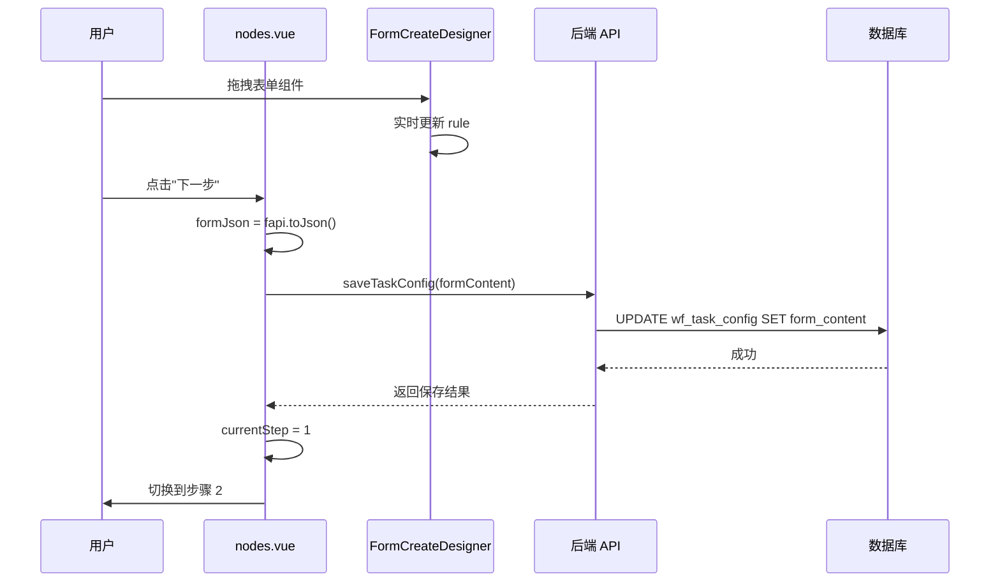

# 审批流增强与企业级工作流实现方案 (修正版)

## 一、需求分析总结

根据您提供的需求文档和现有代码分析，Forgex 工作流模块已具备良好基础，但需要以下增强:

### 1.1 现有优势
- ✅ 可视化流程编辑器 (Vue Flow)
- ✅ 草稿/发布版本管理
- ✅ 基础节点配置 (开始/结束/审批/分支)
- ✅ 任务中心四视图 (我发起/待办/已办/抄送)
- ✅ 执行 API 闭环 (启动/审批/驳回)
- ✅ 回调集成机制
- ✅ SSE 实时通知 + 多租户 + i18n

### 1.2 核心差距
1. **低代码表单配置**: 当前直接维护 JSON，需要 FormCreate 动态设计器
2. **分步骤配置**: 需要在 nodes.vue 页面内集成步骤条 (①表单设计 → ②节点配置)
3. **审批人规则**: 会签/或签/自选/多级上级等
4. **条件表达式**: 可视化规则编辑器
5. **超时处理**: 自动提醒/转交/通过

## 二、核心方案：低代码表单 + 页面内分步向导

### 2.1 技术选型

**低代码表单设计器**:
```
推荐方案：form-create (https://www.form-create.com/)
- Vue3 完整支持
- 拖拽式表单设计
- 支持自定义组件
- 导出标准 JSON
- 支持动态规则和数据联动
```

**步骤条组件**: Ant Design Vue `<a-steps>`

### 2.2 配置流程重构 (修正版)

**重要修正**: 
- nodes.vue 不是配置步骤，而是审批节点配置页面
- 配置步骤是在 nodes.vue 页面内的分步向导
- 用户点击"节点配置"菜单 → 进入 nodes.vue → 页面顶部显示步骤条 → 先设计表单 → 再配置节点

```mermaid
flowchart TB
    A[列表页点击"节点配置"] --> B[进入 nodes.vue 页面]
    B --> C{检查 form_content 是否存在}
    C -->|不存在 | D[显示步骤 1: 表单设计]
    C -->|已存在 | E[显示步骤 2: 节点配置]
    D --> F[使用 FormCreate 设计表单]
    F --> G[点击"下一步"]
    G --> H[保存 form_content 到主表]
    H --> I[切换到步骤 2]
    I --> J[显示 Vue Flow 流程设计器]
    J --> K[配置审批节点和边]
    K --> L[保存草稿/发布]
```

### 2.3 数据库设计 (修正版)

**不需要新增字段**,使用现有字段即可:

| 字段名 | 用途 | 说明 |
|-------|------|------|
| `form_type` | 表单类型 | 1=自定义表单，2=低代码表单 |
| `form_path` | 表单路径 | 自定义表单场景下使用 |
| `form_content` | 表单内容 | **低代码表单 JSON**(form_type=2 时使用) |

**无需新增字段**,因为:
- `form_content` 本身就是用来保存表单 JSON 的
- 步骤状态在前端管理即可，不需要持久化
- 通过检查 `form_content` 是否有值来判断应该显示哪个步骤

### 2.4 前端页面结构 (修正版)

**改造现有 nodes.vue**,集成步骤条和表单设计器:

```
Forgex_Fronted/src/views/workflow/taskConfig/
├── nodes.vue                          # 改造：集成步骤条的分步向导页面
└── components/
    ├── FormCreateDesigner.vue        # 新增：FormCreate 表单设计器封装
    ├── ApproverRuleSelector.vue      # 新增：审批人规则选择器
    └── ConditionExpressionEditor.vue # 新增：条件表达式编辑器
```

### 2.5 核心功能实现 (修正版)

#### nodes.vue 页面集成步骤条

```vue
<template>
  <div class="designer-page">
    <!-- 顶部步骤条 -->
    <a-steps v-model:current="currentStep" class="config-steps">
      <a-step 
        :title="t('workflow.taskConfig.steps.formDesign')" 
        :description="t('workflow.taskConfig.steps.formDesignDesc')"
      />
      <a-step 
        :title="t('workflow.taskConfig.steps.nodeConfig')" 
        :description="t('workflow.taskConfig.steps.nodeConfigDesc')"
      />
    </a-steps>

    <!-- 步骤 1: 表单设计 -->
    <div v-if="currentStep === 0" class="step-content">
      <FormCreateDesigner
        v-model:formJson="formJson"
        v-model:formSchema="formSchema"
      />
    </div>

    <!-- 步骤 2: 节点配置 (现有的 Vue Flow) -->
    <div v-if="currentStep === 1" class="step-content">
      <VueFlow
        v-model:nodes="flowNodes"
        v-model:edges="flowEdges"
        class="designer-flow"
      >
        <!-- 现有的流程设计器内容 -->
      </VueFlow>
    </div>

    <!-- 底部操作按钮 -->
    <div class="step-actions">
      <a-button v-if="currentStep > 0" @click="currentStep--">
        {{ t('common.previous') }}
      </a-button>
      <a-button 
        v-if="currentStep === 0" 
        type="primary" 
        :loading="savingForm"
        @click="handleFormDesignComplete"
      >
        {{ t('workflow.taskConfig.steps.nextStep') }}
      </a-button>
      <a-button 
        v-if="currentStep === 1" 
        :loading="saving"
        @click="handleSave"
      >
        {{ t('workflow.taskConfig.nodes.saveDraft') }}
      </a-button>
      <a-button 
        v-if="currentStep === 1" 
        type="primary"
        :loading="publishing"
        @click="handlePublish"
      >
        {{ t('workflow.taskConfig.nodes.publishDraft') }}
      </a-button>
    </div>
  </div>
</template>

<script setup lang="ts">
const currentStep = ref(0) // 0=表单设计，1=节点配置
const formJson = ref({}) // FormCreate 的 JSON
const formSchema = ref({}) // JSON Schema
const flowNodes = ref([])
const flowEdges = ref([])

// 页面加载时检查是否已有表单设计
async function loadTaskConfig() {
  const config = await getTaskConfigDetail(taskCode.value)
  if (config.formType === 2 && config.formContent) {
    // 已有低代码表单设计，直接跳到步骤 2
    formJson.value = JSON.parse(config.formContent)
    currentStep.value = 1
  }
}

// 表单设计完成，进入下一步
async function handleFormDesignComplete() {
  // 保存表单设计到主表
  await saveTaskConfig({
    taskCode: taskCode.value,
    formType: 2,
    formContent: JSON.stringify(formJson.value)
  })
  
  message.success(t('workflow.taskConfig.steps.formSaved'))
  currentStep.value = 1 // 切换到步骤 2
}
</script>
```

#### FormCreate 表单设计器封装

```vue
<template>
  <div class="form-designer-container">
    <div class="designer-header">
      <h3>{{ t('workflow.taskConfig.formDesigner.title') }}</h3>
      <a-button @click="previewForm">{{ t('workflow.taskConfig.formDesigner.preview') }}</a-button>
    </div>
    
    <div class="designer-body">
      <form-create
        v-model:fapi="fapi"
        :option="designerOption"
        :rule="formRule"
      />
    </div>
  </div>
</template>

<script setup lang="ts">
import { ref, watch } from 'vue'
import formCreate from '@form-create/ant-designv3'

const fapi = ref()
const formJson = defineModel('formJson', { type: Object, required: true })
const formSchema = defineModel('formSchema', { type: Object, required: true })
const formRule = ref([])

// 设计器配置
const designerOption = {
  form: {
    labelWidth: 100,
    size: 'large'
  },
  toolbar: {
    show: true,
    collapsed: false
  }
}

// 监听表单变化，同步到父组件
watch(() => fapi.value, (newVal) => {
  if (newVal) {
    formJson.value = newVal.toJson()
    formSchema.value = newVal.getSchema()
  }
}, { immediate: true })

function previewForm() {
  // 预览表单
  fapi.value?.preview()
}
</script>
```

## 三、企业级工作流增强清单

### 3.1 高优先级 (建议优先实现)

| 功能 | 实现方案 | 工作量 |
|-----|---------|--------|
| **FormCreate 表单设计器** | 封装@form-create/ant-designv3 | 2 天 |
| **步骤条配置流程** | 重构 nodes.vue 为分步式 | 1 天 |
| **审批人规则表设计** | 新建 wf_node_approver_rule | 0.5 天 |
| **会签/或签/逐个审批** | 后端审批逻辑扩展 | 1.5 天 |
| **多级上级审批** | 支持配置上级层级数 | 1 天 |
| **发起人自选审批人** | 发起时弹窗选择 | 1 天 |
| **条件表达式编辑器** | 可视化规则配置 | 2 天 |
| **超时自动处理** | 定时任务 + 超时规则 | 2 天 |

### 3.2 中优先级 (后续迭代)

| 功能 | 实现方案 |
|-----|---------|
| **撤回/转交/加签** | 扩展 WfExecutionApproveParam |
| **审批历史时间线** | 新增 WfExecutionHistory 表 |
| **批量审批** | 前端多选 + 后端批量处理 |
| **委托审批** | 新增 wf_delegation 表 |
| **预置模板库** | 初始化 SQL 脚本 |
| **移动端审批优化** | 适配现有 Android 端 |

### 3.3 低优先级 (可选)

- 流程热力图分析
- 审计导出报表
- Webhook 订阅
- 自动节点 (调用外部 API)

## 四、后端服务扩展

### 4.1 后端扩展 (保持原有方案)

**新增审批人规则 DTO**:

```java
// WfNodeApproverRuleDTO.java
@Data
public class WfNodeApproverRuleDTO {
    private Long id;
    private Long nodeConfigId;
    private Integer approverType; // 1=用户 2=部门 3=角色 4=岗位 5=上级 6=自选
    private List<Long> approverIds;
    private Integer approveMode; // 1=会签 2=或签 3=逐个
    private Integer approvalThreshold;
    private Integer timeoutHours;
    private Integer timeoutAction;
    private List<Long> timeoutAssigneeIds;
    private Integer orderNum;
}
```

**注意**: 后端的 `WfTaskConfigSaveParam` 不需要修改，因为表单 JSON 直接保存到 `formContent` 字段

### 4.3 审批引擎增强

```java
// WfEngineServiceImpl.java
@Override
public void approve(WfExecutionApproveParam param) {
    // 获取当前节点审批规则
    List<WfNodeApproverRuleDTO> rules = approverRuleService.getNodeApproverRules(currentNode.getId());
    
    // 根据审批模式判断是否通过
    boolean passed = evaluateApprovalResult(rules, currentUserAction);
    
    if (passed) {
        moveToNextNode(execution);
    } else {
        // 会签未通过，等待其他人审批
        updateExecutionStatus(execution, ExecutionStatus.WAITING_OTHERS);
    }
    
    // 检查是否需要记录审批历史
    recordApprovalHistory(execution, param);
}

/**
 * 评估审批结果
 */
private boolean evaluateApprovalResult(List<WfNodeApproverRuleDTO> rules, UserAction action) {
    for (WfNodeApproverRuleDTO rule : rules) {
        if (rule.getApproveMode() == 1) { // 会签
            int approvedCount = getApprovedCount(rule);
            if (approvedCount < rule.getApprovalThreshold()) {
                return false;
            }
        } else if (rule.getApproveMode() == 2) { // 或签
            if (!hasAnyApproved(rule)) {
                return false;
            }
        }
        // 逐个审批逻辑
    }
    return true;
}
```

## 五、实施路线图

### 阶段一：低代码表单 + 步骤条 (1 周)
1. 集成 form-create 依赖
2. 开发 FormCreateDesigner 组件
3. 改造 nodes.vue 集成步骤条
4. 实现步骤切换逻辑

### 阶段二：审批人规则增强 (1 周)
1. 创建 wf_node_approver_rule 表
2. 开发 ApproverRuleSelector 组件
3. 实现会签/或签/逐个审批逻辑
4. 支持多级上级配置

### 阶段三：条件表达式与超时 (1 周)
1. 开发 ConditionExpressionEditor
2. 实现超时定时任务
3. 完善审批历史追踪

### 阶段四：测试与优化 (3 天)
1. 单元测试覆盖
2. 端到端测试
3. 性能优化

## 六、关键技术点

### 6.1 FormCreate 集成

**安装依赖**:
```bash
npm install @form-create/ant-designv3 --save
```

**全局注册**:
```typescript
// main.ts
import formCreate from '@form-create/ant-designv3'
import { createApp } from 'vue'

const app = createApp(App)
app.use(formCreate)
```

### 6.2 表单设计器数据流 (修正版)



### 6.3 审批规则执行顺序

```
1. 加载流程配置 → 2. 解析节点审批规则 → 3. 按 order_num 排序
   ↓
4. 依次处理每个规则 → 5. 根据 approveMode 判断 → 6. 返回审批结果
```

## 七、风险与注意事项

### 7.1 技术风险
- FormCreate 与现有表单组件的兼容性
- 审批规则复杂后性能问题 (需加缓存)
- 版本升级时表单 JSON 的兼容性

### 7.2 业务风险
- 审批规则配置过于复杂，用户学习成本高
- 会签票数计算逻辑需与业务方确认
- 超时处理可能影响实际业务流程

### 7.3 回滚方案
- 保留旧版 nodes.vue 作为 fallback
- 分阶段灰度发布

---

**下一步建议**:
1. ✅ 方案已确认：在 nodes.vue 页面内集成步骤条
2. ✅ 数据库确认：无需新增字段，使用现有 form_content 保存表单 JSON
3. 📋 是否开始生成代码实现：
   - FormCreateDesigner.vue 组件
   - nodes.vue 改造 (集成步骤条)
   - 国际化文案
   - API 接口调整