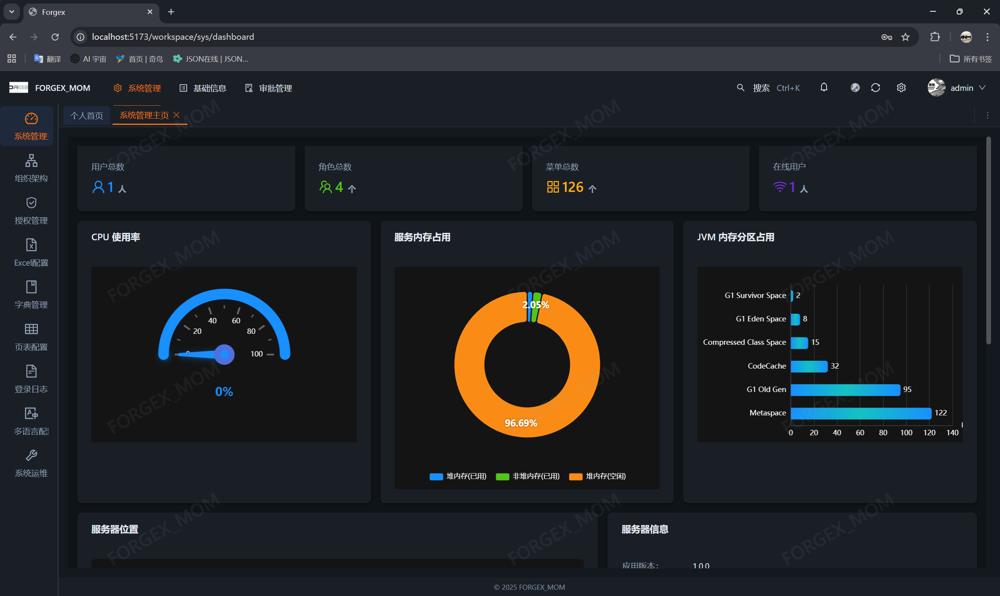
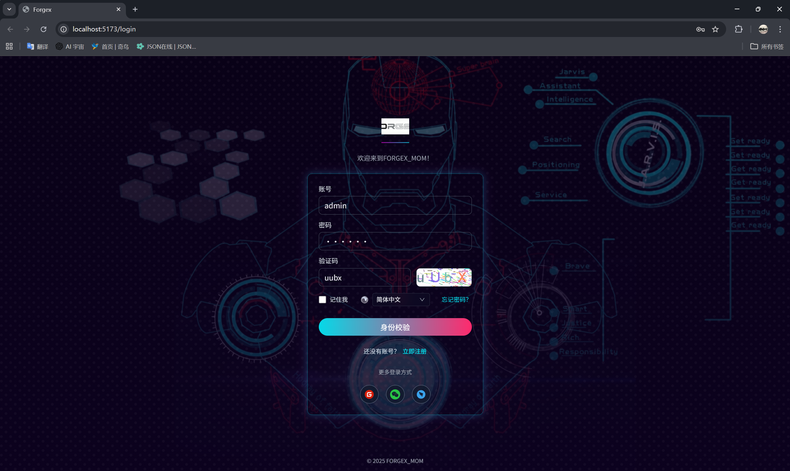
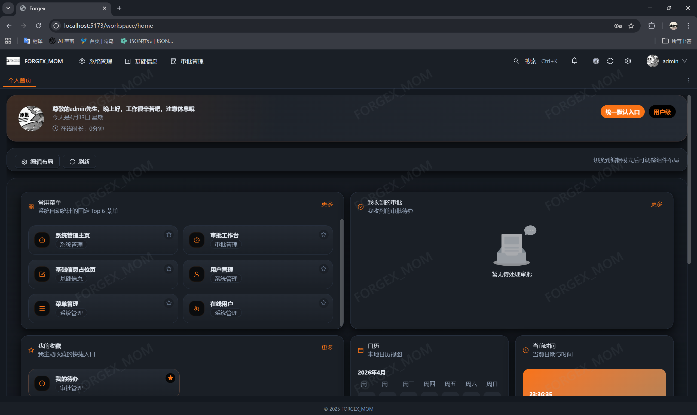
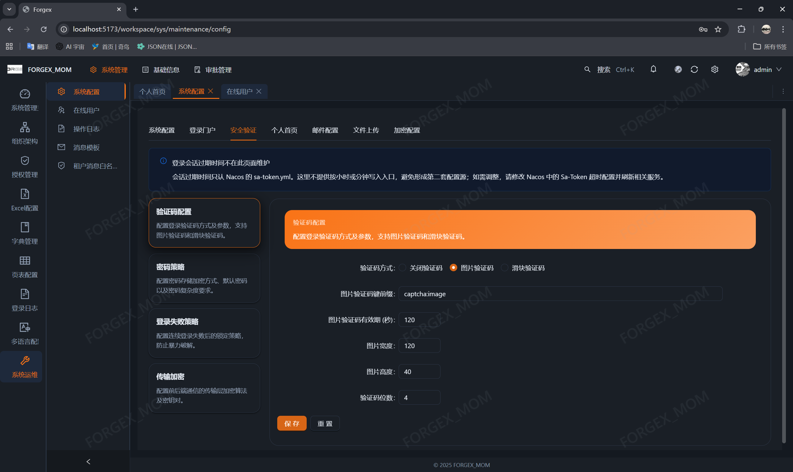
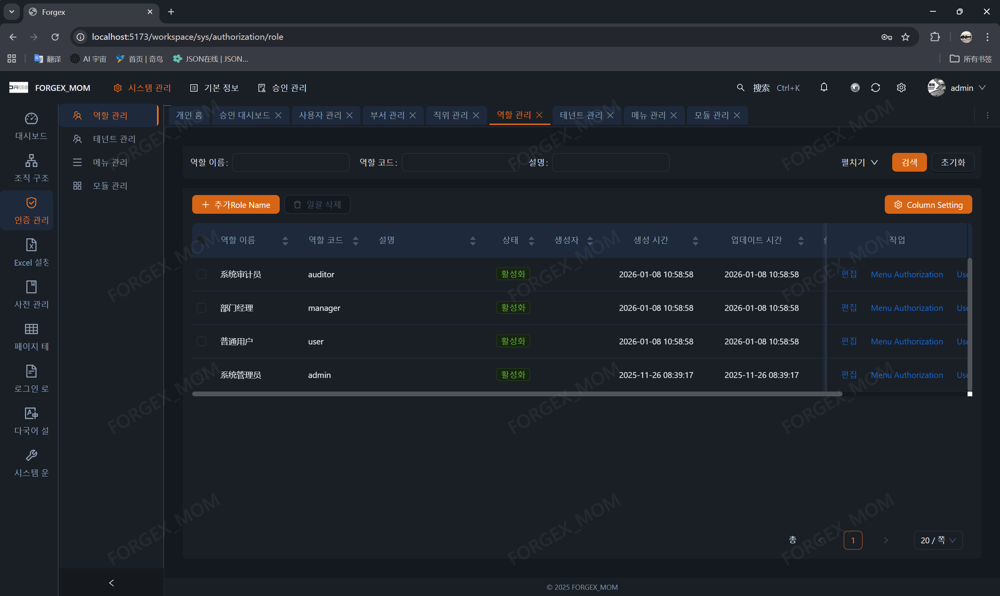
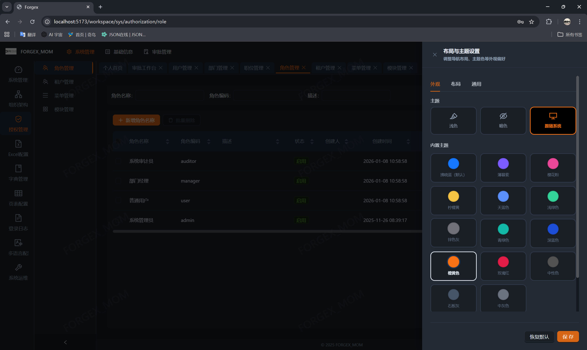

# Forgex

> Enterprise application scaffold and business platform preview edition  
> Current version: **Preview V0.5.0**

## Overview

Forgex is a full-stack enterprise scaffold for business systems. It combines a Vue-based admin console, Spring Cloud microservices, and an Android client skeleton so teams can build on top of a reusable platform instead of recreating common infrastructure from scratch.

The repository currently includes:

- **Web admin console**: Vue 3 + TypeScript + Vite
- **Backend microservice suite**: Spring Boot 3 + Spring Cloud + Spring Cloud Alibaba
- **Android mobile project skeleton**: Kotlin + Compose + Hilt + Retrofit + DataStore

## What changed in Preview V0.5.0

V0.5.0 is a major preview milestone focused on **documentation completeness and capability clarity**.

This version introduces:

1. A new unified documentation hub under `Forgex_Doc`
2. Clear support matrices for backend, frontend, database, Android, and deployment topics
3. Structured navigation from the root README into detailed developer-facing docs

## Documentation Navigation

### Main documentation hub

- [Documentation Home](./Forgex_Doc/README.md)
- [Development Standards](./Forgex_Doc/开发规范/README.md)
- [Backend Docs](./Forgex_Doc/后端/README.md)
- [Frontend Docs](./Forgex_Doc/前端/README.md)
- [Database Docs](./Forgex_Doc/数据库/README.md)
- [Android Docs](./Forgex_Doc/安卓端/README.md)
- [Deployment Docs](./Forgex_Doc/部署/README.md)

### Key direct-entry documents

- [Project Architecture Design](./Forgex_Doc/开发规范/架构设计/项目架构设计文档.md)
- [Backend Common Capabilities Handbook](./Forgex_Doc/后端/后端公共能力与核心功能手册.md)
- [Frontend Common Capabilities Handbook](./Forgex_Doc/前端/前端公共能力与核心功能手册.md)
- [Module document mapping](./Forgex_Doc/开发规范/模块文档映射/README.md)

## Page Preview

### System Homepage



### Login Page



### Personal Homepage (Draggable Layout)



### Personal Homepage Drag Configuration


### System Configuration




### Multi-language User Interface




### Message Center


### Dynamic Layout



### Approval Homepage


## Supported Features

### Backend Features

| Module | Feature | Status | Documentation |
|---|---|---|---|
| **Authentication & Authorization** | Account login, registration, logout | ✅ | [Auth & Authorization](./Forgex_Doc/后端/身份与权限/认证授权.md) |
| | Image captcha, slider captcha | ✅ | [Auth & Authorization](./Forgex_Doc/后端/身份与权限/认证授权.md) |
| | Password policy (bcrypt/SM2/SM4) | ✅ | [Encryption](./Forgex_Doc/后端/模块专题/加密功能.md) |
| | Permission check (@RequirePerm) | ✅ | [Auth & Authorization](./Forgex_Doc/后端/身份与权限/认证授权.md) |
| | Dynamic route generation | ✅ | [Auth & Authorization](./Forgex_Doc/后端/身份与权限/认证授权.md) |
| | Social login (WeChat, DingTalk) | ✅ | [Auth & Authorization](./Forgex_Doc/后端/身份与权限/认证授权.md) |
| **Multi-tenancy** | Row-level tenant isolation | ✅ | [Multi-tenancy](./Forgex_Doc/后端/租户与上下文/多租户.md) |
| | Tenant context propagation | ✅ | [Multi-tenancy](./Forgex_Doc/后端/租户与上下文/多租户.md) |
| | Tenant ignore configuration | ✅ | [Multi-tenancy](./Forgex_Doc/后端/租户与上下文/多租户.md) |
| | Public config fallback mechanism | ✅ | [Multi-tenancy](./Forgex_Doc/后端/租户与上下文/多租户.md) |
| **User & Role** | User management (CRUD) | ✅ | [User & Role](./Forgex_Doc/后端/身份与权限/用户与角色.md) |
| | Role management, authorization | ✅ | [User & Role](./Forgex_Doc/后端/身份与权限/用户与角色.md) |
| | Department, position management | ✅ | System module |
| **Unified Response** | Unified response R<T> | ✅ | [Response & i18n](./Forgex_Doc/后端/配置与审计/统一返回与国际化.md) |
| | Status code management | ✅ | [Response & i18n](./Forgex_Doc/后端/配置与审计/统一返回与国际化.md) |
| | Business exception handling | ✅ | [Response & i18n](./Forgex_Doc/后端/配置与审计/统一返回与国际化.md) |
| **Internationalization** | Request-level multi-language | ✅ | [Response & i18n](./Forgex_Doc/后端/配置与审计/统一返回与国际化.md) |
| | Exception message translation | ✅ | [Response & i18n](./Forgex_Doc/后端/配置与审计/统一返回与国际化.md) |
| | 5 languages support | ✅ | [Response & i18n](./Forgex_Doc/后端/配置与审计/统一返回与国际化.md) |
| **Messaging** | Internal messages | ✅ | [Common Messages & Prompts](./Forgex_Doc/后端/配置与审计/通用消息与提示.md) |
| | Template messages | ✅ | [Message Template & SSE](./Forgex_Doc/后端/配置与审计/消息模板与 SSE.md) |
| | SSE push notifications | ✅ | [Message Template & SSE](./Forgex_Doc/后端/配置与审计/消息模板与 SSE.md) |
| **Redis Tools** | RedisHelper utility class | ✅ | [Redis Tools](./Forgex_Doc/后端/公共能力/Redis 工具.md) |
| | Distributed lock | ✅ | [Redis Tools](./Forgex_Doc/后端/公共能力/Redis 工具.md) |
| | Cache annotations | ✅ | [Redis Tools](./Forgex_Doc/后端/公共能力/Redis 工具.md) |
| **Data Dictionary** | Dictionary management (tree) | ✅ | [Dict & Log](./Forgex_Doc/后端/配置与审计/数据字典与日志.md) |
| | Dictionary tag rendering | ✅ | [Dict & Log](./Forgex_Doc/后端/配置与审计/数据字典与日志.md) |
| | Two-level cache architecture | ✅ | [Dict & Log](./Forgex_Doc/后端/配置与审计/数据字典与日志.md) |
| **Encryption** | Password storage encryption | ✅ | [Encryption](./Forgex_Doc/后端/模块专题/加密功能.md) |
| | Transport encryption (SM2) | ✅ | [Encryption](./Forgex_Doc/后端/模块专题/加密功能.md) |
| | Field transparent encryption | ✅ | [Encryption](./Forgex_Doc/后端/模块专题/加密功能.md) |
| | KMS key management | ✅ | [Encryption](./Forgex_Doc/后端/模块专题/加密功能.md) |
| **Import/Export** | Excel export configuration | ✅ | [Import/Export](./Forgex_Doc/后端/模块专题/导入导出.md) |
| | Excel import configuration | ✅ | [Import/Export](./Forgex_Doc/后端/模块专题/导入导出.md) |
| | Template download | ✅ | [Import/Export](./Forgex_Doc/后端/模块专题/导入导出.md) |
| | Dropdown option provider | ✅ | [Import/Export](./Forgex_Doc/后端/模块专题/导入导出.md) |
| **File Upload** | Local storage | ✅ | [File Upload](./Forgex_Doc/后端/模块专题/文件上传.md) |
| | OSS object storage | ✅ | [File Upload](./Forgex_Doc/后端/模块专题/文件上传.md) |
| | Factory pattern selection | ✅ | [File Upload](./Forgex_Doc/后端/模块专题/文件上传.md) |
| **Workflow** | Process configuration | ✅ | [Workflow & Report](./Forgex_Doc/后端/模块专题/工作流与报表.md) |
| | Start approval, process approval | ✅ | [Workflow & Report](./Forgex_Doc/后端/模块专题/工作流与报表.md) |
| | Pending/processed task management | ✅ | [Workflow & Report](./Forgex_Doc/后端/模块专题/工作流与报表.md) |
| | Callback registration mechanism | ✅ | [Workflow & Report](./Forgex_Doc/后端/模块专题/工作流与报表.md) |
| **Reporting** | Report category management | ✅ | [Workflow & Report](./Forgex_Doc/后端/模块专题/工作流与报表.md) |
| | Report datasource management | ✅ | [Workflow & Report](./Forgex_Doc/后端/模块专题/工作流与报表.md) |
| | Report template management | ✅ | [Workflow & Report](./Forgex_Doc/后端/模块专题/工作流与报表.md) |
| | UReport2, JimuReport integration | ✅ | [Workflow & Report](./Forgex_Doc/后端/模块专题/工作流与报表.md) |
| **Log Audit** | Login logs | ✅ | [Dict & Log](./Forgex_Doc/后端/配置与审计/数据字典与日志.md) |
| | Operation logs | ✅ | [Dict & Log](./Forgex_Doc/后端/配置与审计/数据字典与日志.md) |
| | Audit field auto-filling | ✅ | [Multi-tenancy](./Forgex_Doc/后端/租户与上下文/多租户.md) |

### Frontend Features

| Module | Feature | Status | Documentation |
|---|---|---|---|
| **HTTP Request** | Unified HTTP client | ✅ | [HTTP & Messages](./Forgex_Doc/前端/请求与反馈/HTTP 请求与消息提示.md) |
| | Automatic success/error messages | ✅ | [HTTP & Messages](./Forgex_Doc/前端/请求与反馈/HTTP 请求与消息提示.md) |
| | Silent request mode | ✅ | [HTTP & Messages](./Forgex_Doc/前端/请求与反馈/HTTP 请求与消息提示.md) |
| **Dynamic Table** | FxDynamicTable component | ✅ | [FxDynamicTable](./Forgex_Doc/前端/配置驱动页面/FxDynamicTable 与列设置.md) |
| | User column settings | ✅ | [FxDynamicTable](./Forgex_Doc/前端/配置驱动页面/FxDynamicTable 与列设置.md) |
| | Dictionary translation | ✅ | [FxDynamicTable](./Forgex_Doc/前端/配置驱动页面/FxDynamicTable 与列设置.md) |
| | Pagination & sorting | ✅ | [FxDynamicTable](./Forgex_Doc/前端/配置驱动页面/FxDynamicTable 与列设置.md) |
| **Common Components** | BaseFormDialog | ✅ | [Dialog](./Forgex_Doc/前端/请求与反馈/公共弹窗.md) |
| | DictTag | ✅ | [Dict Docs](./Forgex_Doc/后端/配置与审计/数据字典与日志.md) |
| | IconPicker | ✅ | Component directory |
| | DeptTree | ✅ | [Dept Tree](./Forgex_Doc/前端/组件与页面/部门树与组织选择.md) |
| **Multi-language Input** | I18nInput | ✅ | [i18n & Layout](./Forgex_Doc/前端/国际化与布局/多语言输入与动态布局.md) |
| | I18nJsonEditor | ✅ | [i18n & Layout](./Forgex_Doc/前端/国际化与布局/多语言输入与动态布局.md) |
| | 5 languages support | ✅ | [i18n & Layout](./Forgex_Doc/前端/国际化与布局/多语言输入与动态布局.md) |
| **Draggable Layout** | Personal homepage designer | ✅ | [i18n & Layout](./Forgex_Doc/前端/国际化与布局/个人首页与可拖拽布局.md) |
| | Component drag & drop sorting | ✅ | [i18n & Layout](./Forgex_Doc/前端/国际化与布局/个人首页与可拖拽布局.md) |
| | Size adjustment | ✅ | [i18n & Layout](./Forgex_Doc/前端/国际化与布局/个人首页与可拖拽布局.md) |
| | Visibility control | ✅ | [i18n & Layout](./Forgex_Doc/前端/国际化与布局/个人首页与可拖拽布局.md) |
| **Message Template** | TemplatePreview | ✅ | Message template topic |
| | ReceiverSelector | ✅ | Message template topic |
| **Workflow Pages** | Start approval page | ✅ | Workflow guide |
| | Pending task page | ✅ | Workflow guide |
| | Processed/initiated page | ✅ | Workflow guide |
| **Report Pages** | Report view page | ✅ | Report guide |
| | Report designer integration | ✅ | Report guide |

### Android Features

| Module | Feature | Status | Description |
|---|---|---|---|
| **Architecture** | Multi-module structure | ✅ | app, core/*, feature/* |
| | Dependency injection (Hilt) | ✅ | Unified dependency management |
| | Network request (Retrofit) | ✅ | HTTP client wrapper |
| | Local storage (DataStore) | ✅ | Data persistence |
| **Basic Features** | Login module | ✅ | auth module |
| | Homepage framework | ✅ | home module |
| | Workflow module | ✅ | workflow module |
| | Message module | ✅ | message module |
| | Profile center | ✅ | profile module |
| **Environment** | Multi-environment config | ✅ | dev / test / prod |
| | Device recognition | ✅ | MOBILE / TABLET |

## Repository Structure

```text
forgex
├─ Forgex_Doc                    # Documentation center
├─ doc                           # Old docs (retained)
├─ Forgex_MOM                    # Main project
│  ├─ Forgex_Backend             # Backend
│  │  ├─ Forgex_Auth             # Auth service (8081)
│  │  ├─ Forgex_Sys              # System service (8082)
│  │  ├─ Forgex_Basic            # Basic service
│  │  ├─ Forgex_Common           # Common module
│  │  ├─ Forgex_Gateway          # Gateway (8080)
│  │  ├─ Forgex_Job              # Job service (8083)
│  │  ├─ Forgex_Workflow         # Workflow service (8084)
│  │  └─ Forgex_Report           # Report service (8085)
│  ├─ Forgex_Fronted             # Frontend
│  └─ Forgex_Mobile_Android      # Android mobile
└─ logs                          # Logs
```

## Tech Stack

### Backend

| Technology | Version | Purpose |
|---|---|---|
| Java | 17 | Programming language |
| Spring Boot | 3.5.6 | Application framework |
| Spring Cloud | 2025.0.0 | Microservice framework |
| Spring Cloud Alibaba | 2025.0.0.0-preview | Alibaba microservice suite |
| Sa-Token | 1.44.0 | Authentication framework |
| MyBatis-Plus | 3.5.14 | ORM framework |
| MyBatis-Plus-Join | 1.5.4 | MP join query extension |
| Dynamic Datasource | 4.3.1 | Dynamic datasource |
| Snail-Job | 1.8.1 | Distributed job scheduler |
| FastExcel | 1.3.0 | Excel processing |
| Hutool | 5.8.23 | Java utility library |
| MapStruct | 1.5.5.Final | Object mapping |
| springdoc-openapi | 2.6.0 | API documentation |
| UReport2 | 2.2.10 | Report engine |
| JimuReport | 1.9.0 | Jimu report engine |

### Frontend

| Technology | Version | Purpose |
|---|---|---|
| Vue | 3.5.26 | Frontend framework |
| TypeScript | 5.6.3 | Type system |
| Vite | 5.4.3 | Build tool |
| Ant Design Vue | 4.2.6 | UI component library |
| Pinia | 3.0.4 | State management |
| Vue Router | 4.3.0 | Route management |
| Vue I18n | 9.14.0 | Internationalization |
| Formily | 2.3.7 | Form solution |
| Vue Flow | 1.48.x | Flowchart component |
| ECharts | 6.0.0 | Chart library |
| ApexCharts | 5.3.6 | Chart library |
| Three.js | 0.182.0 | 3D rendering engine |

### Mobile

| Technology | Purpose |
|---|---|
| Kotlin | Programming language |
| Jetpack Compose | UI framework |
| Hilt | Dependency injection |
| Retrofit | Network request |
| DataStore | Data persistence |

## Recommended Reading Paths

### Backend development

1. [Backend Docs](./Forgex_Doc/后端/README.md)
2. [Backend Common Capabilities Handbook](./Forgex_Doc/后端/后端公共能力与核心功能手册.md)
3. [Authentication and Authorization](./Forgex_Doc/后端/身份与权限/认证授权.md)
4. [Multi-tenancy](./Forgex_Doc/后端/租户与上下文/多租户.md)

### Frontend development

1. [Frontend Docs](./Forgex_Doc/前端/README.md)
2. [Frontend Common Capabilities Handbook](./Forgex_Doc/前端/前端公共能力与核心功能手册.md)
3. [FxDynamicTable and Column Settings](./Forgex_Doc/前端/配置驱动页面/FxDynamicTable 与列设置.md)
4. [Frontend HTTP and message guide](./Forgex_Doc/前端/请求与反馈/HTTP 请求与消息提示.md)

### Database and standards

1. [Database Docs](./Forgex_Doc/数据库/README.md)
2. [Development Standards](./Forgex_Doc/开发规范/README.md)

## Quick Start

### Requirements

- JDK 17+
- Maven 3.6+
- Node.js 18+
- MySQL 8.0+
- Redis 6.0+
- Nacos 2.x

### Clone

```bash
git clone <your-repository-url>
cd forgex
```

### Database setup

- Follow the initialization / diagnose / repair script guidance under `Forgex_Doc/数据库/脚本与修复`
- Prepare MySQL, Redis, and Nacos
- See [Database Docs](./Forgex_Doc/数据库/README.md)

### Backend

```bash
cd Forgex_MOM/Forgex_Backend
mvn clean install
```

Start the required services such as:

- `Forgex_Gateway`
- `Forgex_Auth`
- `Forgex_Sys`
- `Forgex_Workflow`
- `Forgex_Report`

### Frontend

```bash
cd Forgex_MOM/Forgex_Fronted
npm install
npm run dev
```

Default local addresses:

- Frontend: `http://localhost:5173`
- Gateway: `http://localhost:8000`

### Android

```bash
cd Forgex_MOM/Forgex_Mobile_Android
gradlew.bat :app:assembleDevDebug
```

## Release Notes

### Preview V0.5.0 · 2026-04

- Introduced `Forgex_Doc` as the unified documentation hub
- Added structured navigation for standards, backend, frontend, database, Android, and deployment
- Clarified supported features with cleaner capability lists
- Consolidated documentation for shared backend/frontend capabilities and important implementation flows
- Linked the root README directly to detailed developer-facing documents
- Improved backend documentation for multi-tenancy, authentication, encryption, import/export, Redis tools
- Improved frontend documentation for HTTP tools, multi-language input, dialogs, dynamic tables, department tree

## License

[Apache 2.0](./LICENSE)

## Contact

- QQ: 3096821283
- Email: coder_nai@163.com
