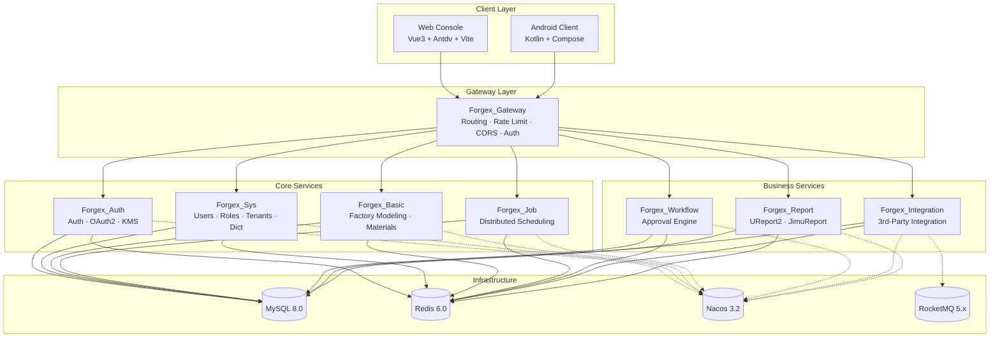

# Forgex


> Full-stack enterprise scaffold and business platform foundation for production manufacturing
> Version: **V0.8.0** (Production Ready)

Forgex is an enterprise-grade scaffold for manufacturing digitalization projects such as MES, WMS, QMS, equipment integration, workflow collaboration, reporting, and private deployment. It is not just a generic admin template for login, menus, and CRUD pages. Forgex packages the repetitive production concerns of enterprise systems into a reusable platform foundation: identity, tenants, permissions, dynamic tables, dictionaries, workflow, messaging, reports, import/export, file storage, integration, packaging, deployment, and upgrade support.

> **V0.8.0** is production-ready: factory modeling, material management, work calendars, and full-stack platform capabilities are battle-tested and ready for real-world manufacturing operations.

## Table of Contents

- [Demo](#demo)
- [What Makes It Different](#what-makes-it-different)
- [Architecture Overview](#architecture-overview)
- [Feature Matrix](#feature-matrix)
- [Tech Stack](#tech-stack)
- [Project Structure](#project-structure)
- [Quick Start](#quick-start)
- [Configuration](#configuration)
- [Deployment](#deployment)
- [Changelog](#changelog)
- [Documentation](#documentation)
- [Contributing](#contributing)
- [Contact](#contact)
- [License](#license)

---

## Demo

- Online demo: [http://175.27.135.204:18080/login](http://175.27.135.204:18080/login)

**Note: The demo environment does not publicly disclose the admin password. Users need to register their own accounts to experience the complete registration flow.**

**How to register:** Copy the invitation code of the role you want to experience, click "Register" on the login page, fill in your information and paste the invitation code. After successful registration, simply log in with your newly created account!

- Normal user invitation code: `D83F9B1E`
- Department manager invitation code: `C40EDD46`
- System auditor invitation code: `948F2D80`


Forgex includes an external-facing user registration capability for enterprise use. Companies can issue invitation codes by role, position, or business scenario, allowing new employees, project members, or trial users to create accounts by themselves. The invitation code completes account creation, role binding, and basic permission activation, so administrators do not need to manually create every user one by one.

## What Makes It Different

Many teams need more than faster CRUD screens. After go-live, enterprise programs keep evolving: org/permission changes, exploding table/dictionary metadata, **consistent multi-language UI + server messages**, **tenant isolation**, **approvals and reporting**, **native mobile access**, **external integrations**, and repeatable **Windows / Linux private deployment** with upgrades. Forgex targets manufacturing-style MOM delivery and keeps these concerns inside one **microservices + web admin + Android skeleton + build/delivery engineering** story, reducing bespoke glue and repetitive platform work.

### Richer Platform Capabilities

- **Deep internationalization**: web defaults for **Simplified & Traditional Chinese, English, Japanese, Korean**; aligns with backend `LangContext`, modular prompts (e.g. `fx_i18n_message`), and **multi-locale JSON + fallback chains** for dictionaries and dynamic table metadata—reducing "English UI, Chinese errors"; includes productized multi-language input patterns for maintainers.
- **Multi-tenant & multi-org**: tenant context propagation, row isolation, ignore rules, public configuration fallback and tenant-facing basics—fits groups, outsourced delivery or domain-separated SaaS.
- **National cryptography & KMS**: full support for Chinese national cryptographic standards (SM2/SM4) alongside international standards (AES-256/RSA/Argon2), built-in Key Management Service (KMS), transparent field-level encryption for MyBatis entities, and file stream encryption.
- **Approval & workflow**: model, start, approve, todo/done queues, business callbacks—extends to QA, exceptions, labor reporting, purchasing-style sign-off paths common on the shop floor.
- **Reporting center**: categories, datasources, template management plus **UReport2 / JimuReport** hooks so analytics lives in the platform instead of scattered one-off scripts.
- **Native Android**: `Forgex_Mobile_Android` (Kotlin, Jetpack Compose, Hilt, Retrofit, DataStore) with dev/test/prod flavors and starter modules aligned to the **same gateway / auth semantics** for roaming tasks and approvals.
- **Integration hub**: third-party systems, authorization, API definitions, parameter mapping, synchronous/asynchronous outbound calls and call logs—less point-to-point glue to ERP/OA/etc.
- **Data-heavy UX engineering**: `FxDynamicTable`, per-user column preferences, dictionary rendering, Excel import/export with templates/providers, avatar/logo/attachment strategies across storage backends.
- **Messaging, jobs & auditing**: templated notices, inbox, SSE push; distributed job scheduling (SnailJob); login/operation trails and auditing field conventions.

### Private Deployment Paths (Windows / Linux)

Forgex ships **artifacts and scripts**, not "clone and figure out production yourself":

- **Windows bundles**: `Forgex_Build` produces ZIP packages with web static assets, service JARs, **bundled Nginx**, **Windows JRE**, **control center**, **license request client**, Nacos config snapshots, database **init** and **upgrade** SQL—suited to intranet appliances or desktop servers.
- **Linux bundles**: tarball delivery, `install.sh`, Nginx templates and the same upgrade/database story—works with Docker Compose, systemd, or customer ops standards.

Follow the "Deployment" section in this README and [deployment docs](./Forgex_Doc/部署/README.md) for exact commands and paths.

### Documentation System (How It Works × How to Use)

`Forgex_Doc` is the official documentation hub, split by **frontend, backend, Android, database, deployment, and engineering standards**. Important topics are documented as paired **implementation + usage** guides so onboarding, QA, and ops share one source of truth. This dual-track approach is specifically designed for **AI-driven development**—feed the docs to your LLM (Copilot, Cursor, etc.) and it will generate code that respects Forgex's unique conventions. Start here: [documentation home](./Forgex_Doc/README.md).

### Unified Three-End Architecture: Web × Microservices × Android

Forgex "three ends" means: **web admin**, **Java microservice cluster**, and **native Android client skeleton**, sharing auth/gateway semantics.

- **Web**: `Forgex_Fronted` (Vue 3 + TypeScript + Vite).
- **Backend**: `Forgex_Gateway` as the entry; services such as `Forgex_Auth`, `Forgex_Sys`, `Forgex_Workflow`, `Forgex_Integration`, `Forgex_Report`, etc.
- **Android**: `Forgex_Mobile_Android` with dev/test/prod flavors; starter modules for login, home, workflow, messaging, and profile.

Aligning the three ends makes **session/permission semantics, release boundaries, and on-site security policies** easier to govern, while keeping a clear surface for **native capabilities** such as push, offline behavior, and device integration.

### UI Quality: A Refined Enterprise Console

On top of Ant Design Vue, Forgex standardizes the "first impression" layer:

- **Theme system**: token-driven light/dark themes and semantic color ramps; brand theming is systematic.
- **Layouts**: multiple navigation modes for different information architectures.
- **Personal workspace**: draggable home widgets with sizing and per-user visibility—more like a real operator cockpit than a fixed demo dashboard.
- **Data-heavy screens**: `FxDynamicTable`, shared dialogs, dictionary rendering, imports/exports—optimized for throughput **and** visual consistency.

## Architecture Overview


```mermaid
graph TB
    subgraph Client["Client Layer"]
        Web["Web Console<br/>Vue3 + Antdv + Vite"]
        Android["Android Client<br/>Kotlin + Compose"]
    end

    subgraph Gateway["Gateway Layer"]
        GW["Forgex_Gateway<br/>Routing · Rate Limit · CORS · Auth"]
    end

    subgraph Core["Core Services"]
        Auth["Forgex_Auth<br/>Auth · OAuth2 · KMS"]
        Sys["Forgex_Sys<br/>Users · Roles · Tenants · Dict"]
        Basic["Forgex_Basic<br/>Factory Modeling · Materials"]
        Job["Forgex_Job<br/>Distributed Scheduling"]
    end

    subgraph Biz["Business Services"]
        WF["Forgex_Workflow<br/>Approval Engine"]
        Integration["Forgex_Integration<br/>3rd-Party Integration"]
        Report["Forgex_Report<br/>UReport2 · JimuReport"]
    end

    subgraph Infra["Infrastructure"]
        MySQL[("MySQL 8.0")]
        Redis[("Redis 6.0")]
        Nacos[("Nacos 3.2")]
        RocketMQ[("RocketMQ 5.x")]
    end

    Web --> GW
    Android --> GW
    GW --> Auth & Sys & Basic & Job & WF & Integration & Report
    Auth & Sys & Basic & Job & WF & Integration & Report --> MySQL
    Auth & Sys & Basic & Job & WF & Integration & Report --> Redis
    Auth & Sys & Basic & Job & WF & Integration & Report -.-> Nacos
    Integration -.-> RocketMQ
```


## Feature Matrix

### Backend


| Module                | Capabilities                                                                                                     |
| --------------------- | ---------------------------------------------------------------------------------------------------------------- |
| Auth & Authorization  | Login, registration, logout, captcha, OAuth2, password encryption, permission checks, dynamic routing            |
| Security & Encryption | SM2/SM4 national crypto, AES-256/RSA, Argon2/Bcrypt, transparent field encryption, file encryption, built-in KMS |
| Users & Organization  | Users, roles, departments, positions, menus, role-based and user-based authorization                             |
| Multi-Tenant          | Tenant isolation, context propagation, ignore rules, public config fallback                                      |
| Factory Modeling      | Workshop → Production Line → Work Section → Process (four-level master data), work calendars, shift management   |
| Material Management   | Finished goods, raw materials, semi-finished products, packaging types, units of measure                         |
| Supplier & Customer   | Supplier master data and reviews; customer master data and import sync                                           |
| Data Dictionary       | Tree dictionaries, dictionary tags, multi-language dictionary values, L2 caching                                 |
| Dynamic Table         | Table config, column config, query config, per-user column preferences                                           |
| Import/Export         | Excel import/export, template downloads, dropdown option providers                                               |
| File Storage          | Local, OSS, MinIO storage strategies; avatar, logo, business file tracking                                       |
| Workflow              | Process configuration, approval initiation, approve/reject, todo/done queues, business callbacks                 |
| Reporting             | Report categories, datasources, template management, UReport2/JimuReport integration                             |
| Integration Hub       | Third-party systems, auth config, API config, parameter mapping, call logs                                       |
| Messaging             | In-app messages, template messages, SSE push                                                                     |
| Audit & Logging       | Login logs, operation logs, auto-filled audit fields                                                             |
| Code Generation       | Online code generator, datasource config, template management                                                    |
| Scheduled Jobs        | Distributed job scheduling (SnailJob), job management, alerts, retries, execution logs                           |


### Frontend


| Module               | Capabilities                                                                                                                                       |
| -------------------- | -------------------------------------------------------------------------------------------------------------------------------------------------- |
| Admin Framework      | Vue 3, TypeScript, Vite, Ant Design Vue, Pinia, Vue Router                                                                                         |
| HTTP & Feedback      | Unified HTTP client, auto success/error notifications, silent request mode                                                                         |
| Config-Driven Pages  | `FxDynamicTable`, column settings, dictionary rendering, pagination, user preferences                                                              |
| Shared Components    | Common dialogs, dictionary tags, icon picker, department tree, import component, multi-language input (`FxI18nInput`), guided tour (`FxGuideTour`) |
| Internationalization | 5 languages (zh-CN, zh-TW, en, ja, ko) with multi-locale form controls                                                                             |
| Personal Workspace   | Draggable homepage widgets, component sorting, sizing, visibility control, layout sharing                                                          |
| Label Templates      | Label type/field/template management, label binding, print records                                                                                 |
| Theme System         | Token-driven light/dark dynamic switching, layout depth layering, brand theme customization                                                        |
| Auth Entry           | Login, registration, invite-code registration, role-based demo experience                                                                          |


### Mobile (Android)


| Module                   | Capabilities                                                                                                                                   |
| ------------------------ | ---------------------------------------------------------------------------------------------------------------------------------------------- |
| Android Engineering      | Kotlin, Jetpack Compose, Hilt, Retrofit, DataStore, multi-module architecture                                                                  |
| UI & Infrastructure      | `core:designsystem` (enterprise design spec), `core:ui` (shared views), networking, navigation, local storage                                  |
| Auth & Home              | Login/logout (`feature:auth`), multi-form workspace & dashboards (`feature:home`)                                                              |
| Office & Collaboration   | Messaging/push (`feature:message`), approval center (`feature:workflow`), profile (`feature:profile`)                                          |
| Manufacturing Micro-Apps | Production with job reporting/QA (`feature:production`), warehouse tracking (`feature:warehouse`), equipment maintenance (`feature:equipment`) |
| Utilities                | Barcode scanning/label parsing (`feature:label`), mobile reports (`feature:report`), integration center (`feature:integration`)                |
| Environment Support      | dev/test/prod flavors, device type detection (PDA & industrial tablet UI adaptation)                                                           |


## Tech Stack

### Backend


| Technology           | Version            | Purpose                  |
| -------------------- | ------------------ | ------------------------ |
| Java                 | 17                 | Language                 |
| Spring Boot          | 3.5.6              | Application framework    |
| Spring Cloud         | 2025.0.0           | Microservice framework   |
| Spring Cloud Alibaba | 2025.0.0.0-preview | Microservice suite       |
| Sa-Token             | 1.44.0             | Auth & permission        |
| MyBatis-Plus         | 3.5.14             | ORM                      |
| MyBatis-Plus-Join    | 1.5.4              | Join queries             |
| Dynamic Datasource   | 4.3.1              | Dynamic data sources     |
| Snail-Job            | 1.8.1              | Distributed scheduling   |
| FastExcel            | 1.3.0              | Excel processing         |
| UReport2             | 2.2.10             | Report engine            |
| JimuReport           | 1.9.0              | Jimu reports             |
| Nacos                | 3.2.2              | Registry & config center |
| RocketMQ             | 5.x                | Message queue            |
| MySQL                | 8.0                | Relational database      |
| Redis                | 6.0                | Cache & sessions         |


### Frontend


| Technology     | Version | Purpose              |
| -------------- | ------- | -------------------- |
| Vue            | 3.5.26  | UI framework         |
| TypeScript     | 5.6.3   | Type system          |
| Vite           | 5.4.3   | Build tool           |
| Ant Design Vue | 4.2.6   | UI component library |
| Pinia          | 3.0.4   | State management     |
| Vue Router     | 4.3.0   | Routing              |
| Vue I18n       | 9.14.0  | Internationalization |
| Formily        | 2.3.7   | Form engine          |
| ECharts        | 6.0.0   | Charting             |
| Three.js       | 0.182.0 | 3D rendering         |


## Project Structure

```text
forgex
├─ Forgex_Doc                    # Documentation hub
├─ Forgex_Build                  # Build, packaging, deployment & upgrade
├─ Forgex_MOM                    # Main project
│  ├─ Forgex_Backend             # Backend microservices
│  │  ├─ Forgex_Gateway          # API Gateway
│  │  ├─ Forgex_Auth             # Auth Service
│  │  ├─ Forgex_Sys              # System Service
│  │  ├─ Forgex_Basic            # Basic Data Service
│  │  ├─ Forgex_Job              # Job Scheduling Service
│  │  ├─ Forgex_Workflow         # Workflow Service
│  │  ├─ Forgex_Integration      # Integration Service
│  │  └─ Forgex_Report           # Report Service
│  ├─ Forgex_Fronted             # Web Admin Console
│  └─ Forgex_Mobile_Android      # Android Skeleton
└─ logs                          # Local logs
```

### Module Quick Reference


| Module               | Responsibility                                    | Required  |
| -------------------- | ------------------------------------------------- | --------- |
| `Forgex_Gateway`     | Entry point, routing, rate limiting, CORS, auth   | ✅ Yes     |
| `Forgex_Auth`        | Authentication, OAuth2, KMS, captcha              | ✅ Yes     |
| `Forgex_Sys`         | Users, roles, departments, tenants, dicts, menus  | ✅ Yes     |
| `Forgex_Basic`       | Factory modeling, materials, customers, suppliers | On demand |
| `Forgex_Job`         | Distributed job scheduling (SnailJob)             | On demand |
| `Forgex_Workflow`    | Approval process config & execution               | On demand |
| `Forgex_Integration` | 3rd-party system integration, API bus             | On demand |
| `Forgex_Report`      | Report center (UReport2 / JimuReport)             | On demand |


## Quick Start

### Requirements


| Component | Minimum Version | Port        |
| --------- | --------------- | ----------- |
| JDK       | 17              | —           |
| Maven     | 3.6             | —           |
| Node.js   | 18              | —           |
| MySQL     | 8.0             | 3306        |
| Redis     | 6.0             | 6379        |
| Nacos     | 3.2.2           | 8848 / 9848 |
| RocketMQ  | 5.x             | 9876        |


### Initialize Database

```bash
# Create database
mysql -u root -p -e "CREATE DATABASE IF NOT EXISTS forgex DEFAULT CHARACTER SET utf8mb4 COLLATE utf8mb4_unicode_ci;"

# Import initialization scripts
mysql -u root -p forgex < Forgex_Doc/部署/数据库初始化脚本/forgex_init.sql
```

Database initialization scripts are under `Forgex_Doc/部署/数据库初始化脚本`. Upgrade SQL is packaged under `database-upgrade/`. Back up the database before running upgrade SQL.

### Backend

```bash
cd Forgex_MOM/Forgex_Backend
mvn clean install
```

Start the required services:

- `Forgex_Gateway`
- `Forgex_Auth`
- `Forgex_Sys`
- `Forgex_Basic`
- `Forgex_Job`
- `Forgex_Workflow`
- `Forgex_Integration`
- `Forgex_Report`

### Frontend

```bash
cd Forgex_MOM/Forgex_Fronted
npm install
npm run dev
```

Default local addresses:

- Frontend: `http://localhost:5173`
- Gateway: `http://localhost:8000`

### Android

```bash
cd Forgex_MOM/Forgex_Mobile_Android
gradlew.bat :app:assembleDevDebug
```

## Configuration

### Key Config Files

Forgex uses Nacos as the configuration center. Each service's `application.yml` configures basic connections (datasource, Redis, Nacos address). Platform-level configs are stored in Nacos under `forgex-*.yml`:


| Config File           | Description                                                         |
| --------------------- | ------------------------------------------------------------------- |
| `application.yml`     | Datasource, Redis, Nacos address (per service, local)               |
| `forgex-auth.yml`     | Token TTL, captcha config, login policies                           |
| `forgex-tenant.yml`   | Multi-tenant isolation rules, ignore tables, public config fallback |
| `forgex-i18n.yml`     | Language locale and fallback chain configuration                    |
| `forgex-security.yml` | KMS key management and encryption algorithm config                  |


### Import Nacos Configs

On first deployment, import the Nacos config snapshots from the `nacos/` directory inside the Forgex_Build artifact.

### Environment Variables


| Variable            | Description          | Default          |
| ------------------- | -------------------- | ---------------- |
| `NACOS_SERVER_ADDR` | Nacos server address | `127.0.0.1:8848` |
| `MYSQL_HOST`        | MySQL host           | `127.0.0.1`      |
| `REDIS_HOST`        | Redis host           | `127.0.0.1`      |


For detailed configuration, see config comments under each service's `src/main/resources/` and the [backend docs](./Forgex_Doc/后端/README.md).

## Deployment

Use `Forgex_Build` to create delivery packages:

```powershell
cd Forgex_Build
powershell -ExecutionPolicy Bypass -File build-all.ps1 -Version 0.8.0 -AllowDistFallback
```

Main outputs:

- `Forgex_Build/dist/windows/Forgex-Windows-Package-0.8.0.zip`
- `Forgex_Build/dist/linux/forgex-linux-bundle-0.8.0.tar.gz`

### Windows

The Windows bundle includes web static assets, service JARs, bundled Nginx, Windows JRE, control center, license request client, Nacos configs, and database init/upgrade scripts. Unzip and follow the installer or scripts in the `scripts/` directory. For upgrades, use `scripts/upgrade.bat` or `scripts/upgrade.ps1`.

### Linux

```bash
tar -zxvf forgex-linux-bundle-0.8.0.tar.gz
cd forgex-linux-bundle-0.8.0
./install.sh ACME_PROD yanshi
```

The Linux bundle includes frontend, backend services, Nginx config templates, Nacos configs, license client, and deployment scripts. Works with Docker Compose, systemd, or custom ops standards.

See [deployment docs](./Forgex_Doc/部署/README.md) for detailed instructions.

## Changelog

Full version history and feature changes: [CHANGELOG.md](./Forgex_Doc/部署/CHANGELOG.md)

## Documentation

- [Documentation home](./Forgex_Doc/README.md)
- [Development standards](./Forgex_Doc/开发规范/README.md)
- [Backend docs](./Forgex_Doc/后端/README.md)
- [Frontend docs](./Forgex_Doc/前端/README.md)
- [Android docs](./Forgex_Doc/安卓端/README.md)
- [Database docs](./Forgex_Doc/数据库/README.md)
- [Deployment docs](./Forgex_Doc/部署/README.md)

## Contributing

Forgex follows the Gitee Flow collaboration model. Community contributions are welcome:

1. **Fork** this repository
2. Create a `develop`branch from `develop`: `develop/your-develop-name`
3. Follow the [development standards](./Forgex_Doc/开发规范/README.md)
4. Ensure local tests pass, then submit a PR to `develop`
5. PRs must pass Code Review before merging

**Commit convention** (Conventional Commits):

- `feat(module): add XX feature`
- `fix(module): fix XX issue`
- `docs: update documentation`
- `refactor(module): refactor XX module`

## Contact

- QQ: 3096821283
- Email: [coder_nai@163.com](mailto:coder_nai@163.com)

## License

[Apache 2.0](./LICENSE)