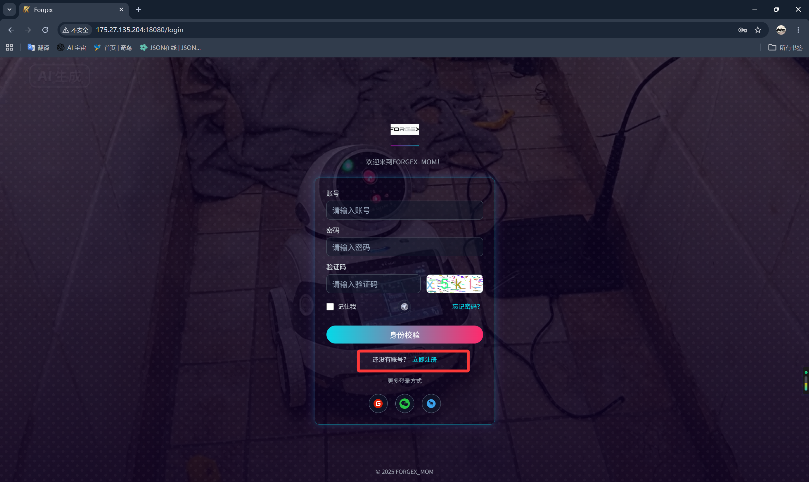
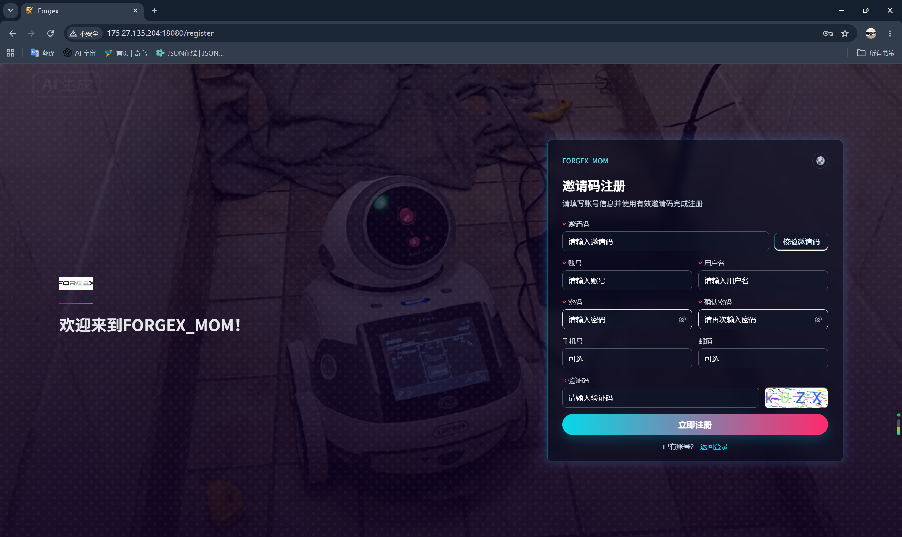

<p align="center">
  
</p>

# Forgex

<div align="center" style="display:flex;flex-wrap:wrap;justify-content:center;align-items:center;gap:3rem;margin:10px auto 14px;width:100%;box-sizing:border-box;">
  <a href="https://gitee.com/coder_nai/forgex/stargazers" title="Gitee Stars" style="display:inline-block;margin:4px clamp(14px,3vw,32px);"></a>
  <a href="https://gitee.com/coder_nai/forgex/members" title="Gitee Forks" style="display:inline-block;margin:4px clamp(14px,3vw,32px);"></a>

</div>

> 🚀 立足生产制造、完美胜任全行业业务的中大型前后端脚手架底座
> 当前版本：**0.7.0 体验版**

**💖 如果你觉得该项目有潜力或者对你有所启发，请点一个 Star ⭐，这是对我们开源作者最大的肯定与支持！**

Forgex 是一款**主打制造业数字化，同时向全行业通用后台**的企业级全栈脚手架。
它不仅仅是一套高颜值、现代化的常规前后台管理系统，更是为重型业务量身定制的平台中枢。我们在提供基础 CRUD 闭环的同时，将复杂项目中反复踩坑的**多租户隔离、穿透式国际化、工作流办理、智能报表中心、第三方系统对接以及私有化一键交付**全面沉淀为开箱即用的技术底座。

🛡️ **百搭且强悍：** 无论你是需要一套支撑 MES、WMS 这类车间级 MOM (制造运营管理) 系统的重工业引擎，还是仅仅想为教育、政务或常规 SaaS 业务寻找一套极具扩展性且坚如磐石的通用后台基架，Forgex 都能为你提供极其强悍的生产力护航！

当前 `0.7.0 体验版` 已具备准生产体验基础，欢迎通过演示环境试用，或入群交流二开与部署方案！

## 💬 联系方式与交流群

- QQ：3096821283
- Email：coder_nai@163.com

<div align="center">
  
  <br/>
  <strong>欢迎各位朋友入群讨论</strong>
</div>

## 🚀 在线演示与注册

👉 **演练环境入口：** <http://175.27.135.204:18080/login>

**说明：本演示环境不对外公开 admin 密码，需要用户自行体验真实的注册全流程。**

**注册方法：** 复制您想体验的角色的邀请码，在登录页点击“注册”，填写信息并输入该邀请码进行注册。注册成功后，直接登录您刚刚创建的账号即可！

- 🧑‍💻 **普通用户邀请码**：`D83F9B1E`
- 👔 **部门经理邀请码**：`C40EDD46`
- 🛡️ **系统审计员邀请码**：`948F2D80`

<div align="center">
  
  
</div>

内置对外自助注册链路，极简放号系统，告别低效手工拉人，极其适合企业内部培训、发码内测与业务试点。

## 💡 核心优势 (Why Forgex?)

团队最怕的不是“初版怎么快”，而是“上线后怎么不失控”。Forgex 将前沿架构能力收拢于 **微服务 + Web + Android 骨架 + 物理交付产线**，大幅降低重复造轮子与跨端维保损耗：

### 📦 沉淀级重工业平台能力

- **🌍 穿透式国际化**：告别“界面英文，报错中文”。前后文透传环境，支持多级 Fallback 与实体多语展现。
- **🏢 真·多租户架构**：数据物理/逻辑隔离，字典与系统配支持跨租户回退补收。
- **🔐 金融级安全加密引擎**：全面支持国密算法 (SM2/SM4) 及国际标准 (AES-256/RSA/Argon2)，自带独立 KMS 密钥管理中心，原生实现文件流式加密与 MyBatis 数据字段透明加解密。
- **🔀 审批引擎与智能报表**：原生整合工作流办理回调与 UReport2 / JimuReport 通用渲染中心。
- **🔌 第三方系统集成总线**：内置 API 出向配置、参数映射与动态鉴权，干掉又臭又长且难以追踪的胶水互调代码。
- **🤖 列表与字典工程**：极度强大的 `FxDynamicTable` 组件，自带千人千面列偏好、跨服字典渲染与免手写导出导入机制。

### 🏭 面向内网闭环的私有化交付体验

拒绝“开发爽一天，部署坑一月”：

- **🪟 Windows 离线包**：自动产出含 JRE、Nginx、Nacos 快照与升级命令的可视化ZIP包，即拷即用，实施人员狂喜。
- **🐧 Linux 自动化套件**：抛弃凌乱脚本，标准 Tar 推送与进程守护初始化底座。

### 📚 体系化的文档（对 AI 开发极度友好）

`Forgex_Doc` 为正式对外文档中心，不仅按 **前端、后端、安卓、数据库、部署、开发规范** 等分册维护，在核心功能抽象上更是全面采用 **「实现逻辑 × 使用方式」** 双轨制编写模式：

- **使用方式**：解决“怎么写业务代码”的问题，直击入参、出参、API和组件调用规范。
- **实现逻辑**：解决“底层怎么生效的”问题，深剖架构设计、上下文透传规则与二次扩展点机制。

**🤖 AI 驱动开发 (AI-Driven Ready)：**
这套细粒度的机制规范文档**极度契合现代大模型（如 GitHub Copilot、Cursor 等 AI 智能体）的上下文检索引擎**。你只需直接向大模型暴露 `Forgex_Doc`，AI 就能迅速建立起专属于本项目的开发认知（Development Skills），彻底理解并吃透全局架构。在后续生成业务代码或重构时，AI 将严格遵循 Forgex 独有约束（如深入服务端的 `fx_i18n_message` 国际化生态、`FxDynamicTable` 的列偏好逻辑等），拒绝自己乱造轮子。这使得 AI 辅助产出不仅高产，且高度符合内聚规范，远超靠“猜”实现的通用型脚手架体验。

总入口：[文档中心](./Forgex_Doc/README.md)。

### 📱 原生级三端协同

不凑合的伪跨端骨架，实现语义一致对齐：

- 💻 **微服务网关引���**：职责分离清晰，权限与跨域环境自动拦截。
- 🌐 **高颜 Web**：Vue 3 + Vite + Antdv，提供极客级开发体验。
- 🤖 **纯原生 Android**：Kotlin + Jetpack Compose 设计，真正适应车间级复杂硬件流转、PDA 扫描与极速响应的现场利器！

### 🎨 惊艳的现代 B 端 UI 工作台

在功能全面的同时，彻底告别包浆后台的审美疲劳：

- 🌈 **极致主题引擎**：令牌化(Token)浅色/深色主题动态演进无感衔接。
- 🎛️ **拖拽流工作台**：属于员工私人的数据驾驶舱（自动记忆组件排序、卡片显隐与缩放）。
- ⚡ **无缝交互收束**：高度统一配置的高级搜索栏、弹窗表单与反馈防抖体系。

## ⚙️ 功能模块一览

### 🔧 后端能力

| 模块 | 能力 |
|---|---|
| 认证与授权 | 登录、注册、登出、验证码、密码加密、权限校验、动态路由、第三方登录预留 |
| 安全与加密 | 国密 (SM2/SM4)、AES-256 / RSA、Argon2/Bcrypt、字段透明加解密、文件加密、自带 KMS (密钥管理中心) |
| 用户与组织 | 用户、角色、部门、岗位、菜单、角色授权、人员授权 |
| 多租户 | 租户隔离、租户上下文传递、租户忽略配置、公共配置回退 |
| 数据字典 | 树形字典、字典标签、多语言字典值、二级缓存 |
| 动态表格 | 表格配置、列配置、查询配置、用户个性化列配置 |
| 导入导出 | Excel 导入、Excel 导出、模板下载、下拉选项 Provider |
| 文件上传 | 本地、OSS、MinIO 存储策略，头像、Logo、业务文件归属记录 |
| 工作流 | 流程配置、发起审批、审批处理、待办/已办、业务回调 |
| 报表中心 | 报表分类、数据源、模板管理、UReport2/JimuReport 集成 |
| 集成平台 | 第三方系统、授权配置、API 配置、参数映射、调用日志 |
| 消息通知 | 站内消息、模板消息、SSE 推送 |
| 审计与日志 | 登录日志、操作日志、审计字段自动填充 |

### 🖥️ 前端基建

| 模块 | 能力 |
|---|---|
| 管理端框架 | Vue 3、TypeScript、Vite、Ant Design Vue、Pinia、Vue Router |
| 请求与反馈 | 统一 HTTP 客户端、自动成功/失败提示、静默请求模式 |
| 配置驱动页面 | `FxDynamicTable`、列设置、字典渲染、分页排序、用户列偏好 |
| 公共组件 | 公共弹窗、字典标签、图标选择器、部门树、导入组件 |
| 国际化 | 简体中文、繁体中文、英文、日文、韩文 |
| 个性化布局 | 个人首页拖拽布局、组件排序、尺寸调整、显隐控制 |
| 认证入口 | 登录、注册、邀请码注册、不同角色体验入口 |

### 📱 移动原生

| 模块 | 能力 |
|---|---|
| Android 工程 | Kotlin、Jetpack Compose、Hilt、Retrofit、DataStore、多模块组件化架构 |
| UI 与基建 (`core`) | `core:designsystem` (企业级设计规范)、`core:ui` (公共视图)、网络、导航、本地存储组件 |
| 认证与首页 | 登录/登出 (`feature:auth`)、多形态工作台与数据看板 (`feature:home`) |
| 办公与协同 | 会话/推送 (`feature:message`)、流程审批中心 (`feature:workflow`)、个人中心 (`feature:profile`) |
| 生产制造微应用 | 包含报工/质检的制造模块 (`feature:production`)、仓储追溯 (`feature:warehouse`)、设备运维 (`feature:equipment`) |
| 辅助工具 | 扫码/标签解析 (`feature:label`)、移动报表 (`feature:report`)、三方集成中心 (`feature:integration`) |
| 环境支持 | dev/test/prod 多环境配置、设备类型识别 (支持定制 PDA 及工业平板 UI 适配) |

## 🛠️ 技术栈清单

### ☕ 核心后端

| 技术 | 版本 | 用途 |
|---|---|---|
| Java | 17 | 开发语言 |
| Spring Boot | 3.5.6 | 应用框架 |
| Spring Cloud | 2025.0.0 | 微服务框架 |
| Spring Cloud Alibaba | 2025.0.0.0-preview | 微服务套件 |
| Sa-Token | 1.44.0 | 权限认证 |
| MyBatis-Plus | 3.5.14 | ORM |
| MyBatis-Plus-Join | 1.5.4 | 联表查询 |
| Dynamic Datasource | 4.3.1 | 动态数据源 |
| Snail-Job | 1.8.1 | 分布式任务调度 |
| FastExcel | 1.3.0 | Excel 处理 |
| UReport2 | 2.2.10 | 报表引擎 |
| JimuReport | 1.9.0 | 积木报表 |

### ✨ 炫酷前端

| 技术 | 版本 | 用途 |
|---|---|---|
| Vue | 3.5.26 | 前端框架 |
| TypeScript | 5.6.3 | 类型系统 |
| Vite | 5.4.3 | 构建工具 |
| Ant Design Vue | 4.2.6 | UI 组件库 |
| Pinia | 3.0.4 | 状态管理 |
| Vue Router | 4.3.0 | 路由管理 |
| Vue I18n | 9.14.0 | 国际化 |
| Formily | 2.3.7 | 表单能力 |
| ECharts | 6.0.0 | 图表 |
| Three.js | 0.182.0 | 3D 渲染 |

## 📂 工程骨架

```text
forgex
├─ Forgex_Doc                    # 文档中心
├─ Forgex_Build                  # 构建、打包、部署与升级工程
├─ Forgex_MOM                    # 主工程
│  ├─ Forgex_Backend             # 后端微服务
│  │  ├─ Forgex_Gateway          # 网关服务
│  │  ├─ Forgex_Auth             # 认证服务
│  │  ├─ Forgex_Sys              # 系统服务
│  │  ├─ Forgex_Basic            # 基础资料服务
│  │  ├─ Forgex_Job              # 任务调度服务
│  │  ├─ Forgex_Workflow         # 工作流服务
│  │  ├─ Forgex_Integration      # 集成平台服务
│  │  └─ Forgex_Report           # 报表服务
│  ├─ Forgex_Fronted             # Web 管理端
│  └─ Forgex_Mobile_Android      # Android 移动端骨架
└─ logs                          # 本地日志目录
```

## 🚀 极速起步

### 📌 先决条件

- JDK 17+
- Maven 3.6+
- Node.js 18+
- MySQL 8.0+
- Redis 6.0+
- Nacos 3.2.2（服务/API 主端口 `8848`，控制台默认 `8080`，客户端 gRPC 默认 `9848`）
- RocketMQ 5.x

### 💾 初始化数据库

数据库初始化脚本位于 `Forgex_Doc/部署/数据库初始化脚本`，升级包中的升级 SQL 位于 `database-upgrade/`。首次部署先导入初始化脚本；已有环境升级时，先备份数据库，再按升级包说明和 SQL 文件名顺序执行需要的升级脚本。

### ⚙️ 启动服务引擎

```bash
cd Forgex_MOM/Forgex_Backend
mvn clean install
```

按实际场景启动以下服务：

- `Forgex_Gateway`
- `Forgex_Auth`
- `Forgex_Sys`
- `Forgex_Basic`
- `Forgex_Job`
- `Forgex_Workflow`
- `Forgex_Integration`
- `Forgex_Report`

### 🌐 唤醒前端模块

```bash
cd Forgex_MOM/Forgex_Fronted
npm install
npm run dev
```

默认本地地址：

- 前端：`http://localhost:5173`
- 网关：`http://localhost:8000`

### 📱 拥抱 Android

```bash
cd Forgex_MOM/Forgex_Mobile_Android
gradlew.bat :app:assembleDevDebug
```

## 🛳️ 现场化部署方案

### 🪟 Windows 内网一键包

`Forgex_Build` 提供 Windows 交付包和安装脚本，交付包包含前端静态资源、后端服务 JAR、Windows JRE、内置 Nginx、控制中心、授权请求客户端、Nacos 配置、数据库初始化脚本和数据库升级脚本。

```powershell
cd Forgex_Build
powershell -ExecutionPolicy Bypass -File build-all.ps1 -Version 0.7.0 -AllowDistFallback
```

构建后主要产物：

- `Forgex_Build/dist/windows/Forgex-Windows-Package-0.7.0.zip`
- `Forgex_Build/dist/linux/forgex-linux-bundle-0.7.0.tar.gz`

Windows 首次部署时，解压交付包后按安装器或 `scripts` 目录中的脚本完成安装、数据库导入、Nacos 配置导入和服务启动。已有环境升级时，使用新包中的 `scripts/upgrade.bat` 或 `scripts/upgrade.ps1` 替换应用文件，并在数据库备份后按需执行 `database-upgrade` 里的 SQL。

### 🐧 Linux 自动化编排

Linux 交付包包含前端、后端服务、Nginx 配置模板、Nacos 配置、授权客户端和部署脚本。解压后通过 `install.sh` 初始化目录和环境变量，再结合 Docker Compose 或现场服务管理方式启动后端服务。

```bash
tar -zxvf forgex-linux-bundle-0.7.0.tar.gz
cd forgex-linux-bundle-0.7.0
./install.sh ACME_PROD yanshi
```

详细部署说明见 [部署文档](./Forgex_Doc/部署/README.md)。

## 📖 知识库全景入口

- [📚 文档中心首页](./Forgex_Doc/README.md)
- [📏 开发规范](./Forgex_Doc/开发规范/README.md)
- [☕ 后端文档](./Forgex_Doc/后端/README.md)
- [✨ 前端文档](./Forgex_Doc/前端/README.md)
- [📱 安卓端文档](./Forgex_Doc/安卓端/README.md)
- [💾 数据库文档](./Forgex_Doc/数据库/README.md)
- [🛳️ 部署文档](./Forgex_Doc/部署/README.md)

## 📄 版权与协议

[Apache 2.0](./LICENSE)
