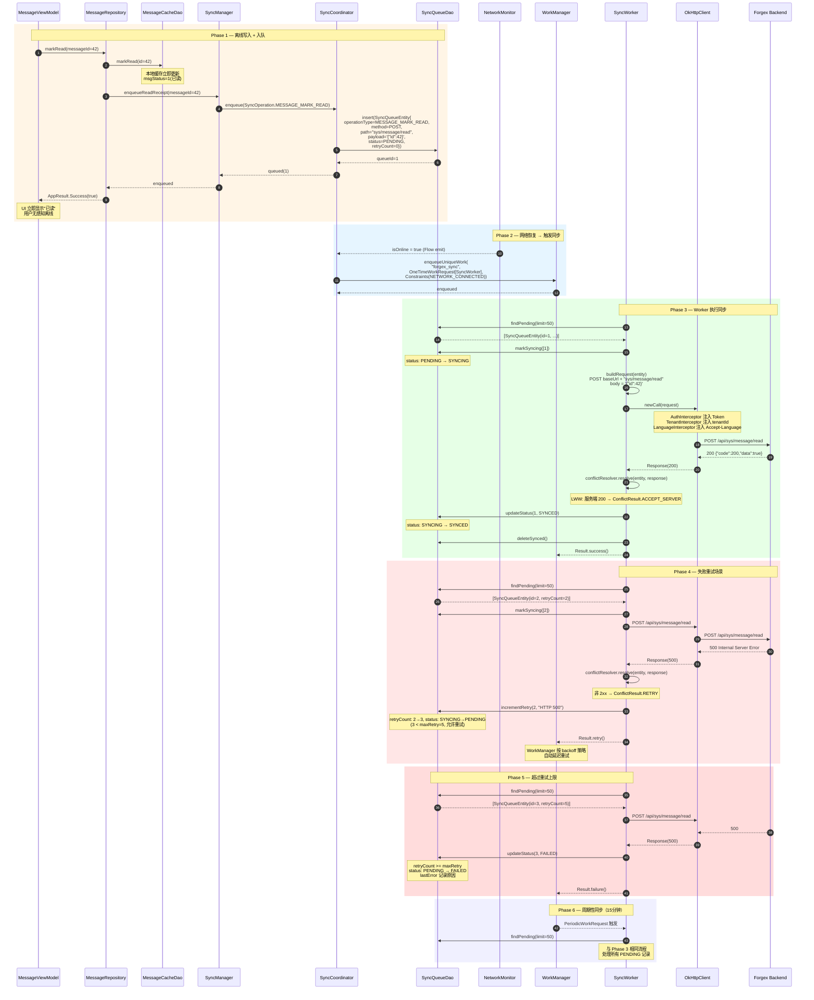
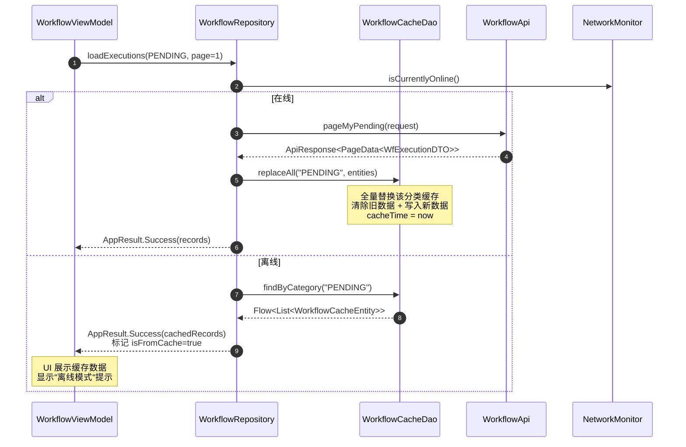
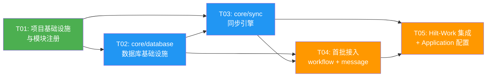

# Forgex 移动端离线能力架构设计（问题9 · 组E）

> 架构师：高见远（Gao）  
> 日期：2026-06-21  
> 适用版本：Forgex V0.8.0  
> Android工程：`Forgex_MOM/Forgex_Mobile_Android`  
> 状态：**设计完成，待工程师实现**

---

## Part A: System Design

### 1. 实现方案与框架选型

#### 1.1 核心技术挑战

| 挑战 | 说明 |
|------|------|
| **Room 声明未使用** | `libs.versions.toml` 已声明 room-runtime/ktx/compiler 2.6.1，但全工程无 `@Database` 类。需要从零搭建数据库基础设施，且须兼容现有 KSP 1.9.24-1.0.20 编译链 |
| **模块化依赖管理** | 现有 11 个 core + 13 个 feature 模块，新增 core/database 和 core/sync 两个模块须避免循环依赖。`@Database` 需聚合所有 Entity，但 Entity 可能散布于多个 feature 模块 |
| **Hilt-Work 集成** | 现有 Hilt 通过 kapt 编译（convention plugin `forgex.android.hilt`），WorkManager Worker 需 `@HiltWorker` 注入，需引入 `androidx.hilt:hilt-compiler` 并改造 `ForgexApplication` 实现 `Configuration.Provider` |
| **同步冲突** | 离线写入与服务端可能产生时间窗口冲突，需确定冲突解决策略。首批为只读缓存 + 写入入队，冲突场景有限但须预留扩展接口 |
| **网络状态感知** | 现有 `ConnectivityMonitor`（core/network）仅提供同步 `isConnected()` 方法，无响应式监听。离线同步需网络恢复时自动触发 |

#### 1.2 框架选型与理由

| 框架 | 版本 | 选型理由 |
|------|------|----------|
| **Room** | 2.6.1（已声明） | Jetpack 官方 ORM，编译期 SQL 校验，Flow 响应式查询。版本已在 catalog 声明，KSP 编译器与项目 KSP 1.9.24-1.0.20 兼容。对比 SQLite 原生 API 减少约 60% 样板代码 |
| **WorkManager** | 2.9.0 | Jetpack 官方后台任务调度，支持周期性 + 约束触发（联网/电量），进程死亡后自动恢复。对比 JobScheduler 兼容性更广（API 30+ 本项目 minSdk=30 直接用 JobScheduler 调度层），对比自定义 Foreground Service 更省电且系统友好 |
| **Hilt-Work** | 1.2.0 | `@HiltWorker` 注入 Hilt 依赖到 Worker，与现有 Hilt 2.52 DI 体系无缝集成。版本与已有 `hilt-navigation-compose` 1.2.0 对齐 |
| **OkHttp** | 4.12.0（已有） | SyncWorker 复用现有 OkHttpClient（含 AuthInterceptor/TenantInterceptor/LanguageInterceptor），确保离线重放请求携带完整认证上下文 |

#### 1.3 同步策略：Last-Write-Wins（LWW），服务端权威

**选择理由**：
- 首批场景为"只读缓存优先 + 写入入队"，写入操作仅 message 已读回执（幂等操作），冲突概率极低
- LWW 实现简单可靠，服务端 `updateTime` 为权威时间戳，客户端以服务端响应为准
- 对比 CRDT/OT 等复杂策略，LWW 在 MES 制造执行系统中满足业务需求（审批流/消息均为服务端权威数据）

**冲突场景与边界**：
1. **场景A — 客户端写入与服务端无冲突**：客户端入队 → 联网重放 → 服务端 200 → 标记 SYNCED。无冲突
2. **场景B — 客户端写入时服务端数据已变更**：客户端离线标记已读 → 联网重放 `POST sys/message/read` → 服务端幂等处理（已读标记不可逆）→ 200 → SYNCED。LWW 自动解决
3. **场景C — 服务端返回 409 Conflict**：标记 FAILED，保留 payload 供用户决策。首批不自动重试冲突类失败
4. **场景D — 服务端返回 404（数据已被删除）**：标记 SYNCED 并从队列移除（目标已达成，无需重试）
5. **边界 — 重试上限**：达到 `MAX_RETRY_COUNT`（默认 5）后标记 FAILED，不再自动重试，等待人工介入或下次全量同步覆盖

#### 1.4 架构模式

采用 **Repository + Offline-First** 模式：

```
┌─────────────────────────────────────────────────────────┐
│                    Feature (UI Layer)                     │
│              ViewModel → UiState (Compose)                │
├─────────────────────────────────────────────────────────┤
│                  Feature (Repository)                     │
│    OfflineRepository: 先查本地缓存 → 联网刷新 → 回写缓存    │
│    写操作: 写本地缓存 + 入队 SyncQueue → 返回成功          │
├──────────────┬──────────────────────┬───────────────────┤
│  core/sync   │     core/database    │    core/network    │
│  SyncManager │  ForgexDatabase      │  Retrofit/OkHttp   │
│  SyncWorker  │  Entity / Dao        │  Api interfaces     │
│  ConflictRsv │  TypeConverters      │  Interceptors       │
│  NetworkMon  │  DatabaseModule(Hilt)│  NetworkModule(Hilt)│
├──────────────┴──────────────────────┴───────────────────┤
│              Hilt DI (SingletonComponent)                 │
│         WorkManager (HiltWorkerFactory)                   │
└─────────────────────────────────────────────────────────┘
```

#### 1.5 模块依赖关系（关键决策：打破循环依赖）

```
core/common ←── core/database ←── core/sync ←── feature/workflow
                    ↑                    ↑       feature/message
                    └────────────────────┘
```

**关键决策：SyncQueueEntity/Dao 放在 core/database，不放 core/sync**

虽然任务描述将 SyncQueueEntity/Dao 列在 core/sync 范围内，但 `@Database` 注解需要列出所有 Entity，`ForgexDatabase` 定义在 core/database。若 SyncQueueEntity 在 core/sync，则 core/database 需依赖 core/sync，而 core/sync 又需依赖 core/database（获取 Dao），形成循环依赖。

**解决方案**：所有 `@Entity` 和 `@Dao` 统一放在 core/database（数据层），core/sync 仅包含同步逻辑（业务层）。这符合"数据下沉、逻辑上浮"的分层原则，也与 Google "Now in Android" 架构一致。

---

### 2. 文件列表

所有路径相对于 `Forgex_MOM/Forgex_Mobile_Android/`。

#### 2.1 配置文件（修改）

| 文件 | 动作 |
|------|------|
| `settings.gradle.kts` | 修改：注册 `:core:database`、`:core:sync` |
| `gradle/libs.versions.toml` | 修改：增 work-runtime/hilt-work/hilt-compiler/gson 版本与依赖声明 |
| `app/build.gradle.kts` | 修改：增 `:core:database`、`:core:sync`、hilt-work 依赖 |
| `app/src/main/java/com/forgex/mobile/ForgexApplication.kt` | 修改：实现 `Configuration.Provider`，注入 `HiltWorkerFactory` |
| `feature/workflow/build.gradle.kts` | 修改：增 `:core:database`、`:core:sync` 依赖 |
| `feature/message/build.gradle.kts` | 修改：增 `:core:database`、`:core:sync` 依赖 |

#### 2.2 core/database 模块（新增）

| 文件 | 说明 |
|------|------|
| `core/database/build.gradle.kts` | 模块构建配置：forgex.android.library + forgex.android.hilt + KSP( Room compiler) |
| `core/database/src/main/AndroidManifest.xml` | 空清单（library 模块必需） |
| `core/database/src/main/java/com/forgex/mobile/core/database/entity/BaseEntity.kt` | 抽象基类 Entity：id/createdAt/updatedAt/syncStatus |
| `core/database/src/main/java/com/forgex/mobile/core/database/entity/SyncQueueEntity.kt` | 同步队列表：operationType/method/path/payload/retryCount/status |
| `core/database/src/main/java/com/forgex/mobile/core/database/entity/WorkflowCacheEntity.kt` | 待办缓存表：映射 WfExecutionDTO + cacheKey/category |
| `core/database/src/main/java/com/forgex/mobile/core/database/entity/MessageCacheEntity.kt` | 消息缓存表：映射 SysMessageVO + cacheKey/status |
| `core/database/src/main/java/com/forgex/mobile/core/database/dao/BaseDao.kt` | 泛型 DAO 基接口：insert/update/delete/query |
| `core/database/src/main/java/com/forgex/mobile/core/database/dao/SyncQueueDao.kt` | 同步队列 DAO：按状态查询/更新/批量操作 |
| `core/database/src/main/java/com/forgex/mobile/core/database/dao/WorkflowCacheDao.kt` | 待办缓存 DAO：按 category 查询/批量插入/清空 |
| `core/database/src/main/java/com/forgex/mobile/core/database/dao/MessageCacheDao.kt` | 消息缓存 DAO：按 status 查询/批量插入/更新已读 |
| `core/database/src/main/java/com/forgex/mobile/core/database/converter/Converters.kt` | TypeConverters：Long↔LocalDateTime / Map↔JSON(String) |
| `core/database/src/main/java/com/forgex/mobile/core/database/ForgexDatabase.kt` | @Database 聚合类：entities + version + migrations |
| `core/database/src/main/java/com/forgex/mobile/core/database/di/DatabaseModule.kt` | Hilt Module：@Provides ForgexDatabase + 各 Dao |

#### 2.3 core/sync 模块（新增）

| 文件 | 说明 |
|------|------|
| `core/sync/build.gradle.kts` | 模块构建配置：forgex.android.library + forgex.android.hilt + work-runtime + hilt-work |
| `core/sync/src/main/AndroidManifest.xml` | 空清单 |
| `core/sync/src/main/java/com/forgex/mobile/core/sync/model/SyncStatus.kt` | 同步状态枚举 + 状态机定义 |
| `core/sync/src/main/java/com/forgex/mobile/core/sync/model/SyncOperation.kt` | 操作类型枚举（HTTP method + 业务 operationType） |
| `core/sync/src/main/java/com/forgex/mobile/core/sync/network/NetworkMonitor.kt` | 响应式网络监听：ConnectivityManager callback → Flow<Boolean> |
| `core/sync/src/main/java/com/forgex/mobile/core/sync/conflict/ConflictResolver.kt` | 冲突解决接口 + LWW 默认实现 |
| `core/sync/src/main/java/com/forgex/mobile/core/sync/worker/SyncWorker.kt` | @HiltWorker CoroutineWorker：取队列 → OkHttp 重放 → 冲突处理 |
| `core/sync/src/main/java/com/forgex/mobile/core/sync/coordinator/SyncCoordinator.kt` | 协调器：管理队列状态流转 + Worker 调度 + 重试策略 |
| `core/sync/src/main/java/com/forgex/mobile/core/sync/SyncManager.kt` | 对外门面（Facade）：enqueue / triggerSync / observeSyncState |
| `core/sync/src/main/java/com/forgex/mobile/core/sync/di/SyncModule.kt` | Hilt Module：@Provides SyncManager / NetworkMonitor / ConflictResolver / WorkManager 调度配置 |

#### 2.4 Feature 接入（修改 + 新增）

| 文件 | 动作 | 说明 |
|------|------|------|
| `feature/workflow/src/main/java/com/forgex/mobile/feature/workflow/data/WorkflowRepository.kt` | 修改 | 增离线缓存逻辑：先查 Room → 联网刷新 → 回写缓存 |
| `feature/message/src/main/java/com/forgex/mobile/feature/message/data/MessageRepository.kt` | 修改 | 增离线缓存 + 已读回执入队 SyncManager |
| `feature/workflow/src/main/java/com/forgex/mobile/feature/workflow/WorkflowViewModel.kt` | 修改 | 适配离线 Repository 返回的 Flow 数据源 |
| `feature/message/src/main/java/com/forgex/mobile/feature/message/MessageViewModel.kt` | 修改 | 适配离线 Repository + 已读回执离线入队 |
| `app/src/main/java/com/forgex/mobile/di/WorkManagerInitializer.kt` | 新增 | WorkManager 初始化配置 + 周期性同步任务注册 |

---

### 3. 数据结构与接口（类图）

```mermaid
classDiagram
    direction TB

    %% ====== Enums ======
    class SyncStatus {
        <<enum>>
        PENDING
        SYNCING
        SYNCED
        FAILED
    }

    class SyncOperationType {
        <<enum>>
        MESSAGE_MARK_READ
        MESSAGE_MARK_ALL_READ
        WORKFLOW_APPROVE
    }

    class HttpMethod {
        <<enum>>
        GET
        POST
        PUT
        DELETE
    }

    %% ====== Entities ======
    class BaseEntity {
        <<abstract>>
        +id: Long
        +createdAt: Long
        +updatedAt: Long
        +syncStatus: SyncStatus
    }

    class SyncQueueEntity {
        +operationType: SyncOperationType
        +method: HttpMethod
        +path: String
        +payload: String
        +retryCount: Int
        +maxRetry: Int
        +lastError: String?
        +entityId: Long?
        +queuedAt: Long
    }

    class WorkflowCacheEntity {
        +taskConfigId: Long?
        +taskCode: String?
        +taskName: String?
        +initiatorName: String?
        +currentNodeName: String?
        +status: Int?
        +startTime: String?
        +category: String
        +cacheTime: Long
    }

    class MessageCacheEntity {
        +senderName: String?
        +messageType: String?
        +title: String?
        +content: String?
        +linkUrl: String?
        +msgStatus: Int?
        +createTime: String?
        +readTime: String?
        +category: String
        +cacheTime: Long
    }

    BaseEntity <|-- SyncQueueEntity
    BaseEntity <|-- WorkflowCacheEntity
    BaseEntity <|-- MessageCacheEntity

    %% ====== DAOs ======
    class BaseDao~T~ {
        <<interface>>
        +insert(entity: T): Long
        +update(entity: T)
        +delete(entity: T)
        +findById(id: Long): T?
    }

    class SyncQueueDao {
        +findByStatus(status: SyncStatus): List~SyncQueueEntity~
        +findPending(limit: Int): List~SyncQueueEntity~
        +updateStatus(id: Long, status: SyncStatus)
        +incrementRetry(id: Long, error: String)
        +deleteSynced()
        +countByStatus(status: SyncStatus): Flow~Int~
        +markSyncing(ids: List~Long~)
    }

    class WorkflowCacheDao {
        +findByCategory(category: String): Flow~List~WorkflowCacheEntity~~
        +replaceAll(category: String, items: List~WorkflowCacheEntity~)
        +clearByCategory(category: String)
        +getCacheTime(category: String): Long?
    }

    class MessageCacheDao {
        +findByCategory(category: String): Flow~List~MessageCacheEntity~~
        +replaceAll(category: String, items: List~MessageCacheEntity~)
        +markRead(id: Long)
        +markAllRead()
        +clearByCategory(category: String)
    }

    BaseDao <|-- SyncQueueDao
    BaseDao <|-- WorkflowCacheDao
    BaseDao <|-- MessageCacheDao

    %% ====== Database ======
    class ForgexDatabase {
        <<@Database>>
        +syncQueueDao(): SyncQueueDao
        +workflowCacheDao(): WorkflowCacheDao
        +messageCacheDao(): MessageCacheDao
    }

    %% ====== Converters ======
    class Converters {
        <<@TypeConverters>>
        +fromTimestamp(value: Long?): LocalDateTime?
        +toTimestamp(date: LocalDateTime?): Long?
        +fromStringMap(value: String?): Map~String, String~
        +toStringMap(map: Map~String, String~?): String
    }

    ForgexDatabase ..> Converters : @TypeConverters
    ForgexDatabase ..> SyncQueueEntity : entities
    ForgexDatabase ..> WorkflowCacheEntity : entities
    ForgexDatabase ..> MessageCacheEntity : entities

    %% ====== Sync Logic ======
    class NetworkMonitor {
        -context: Context
        -connectivityManager: ConnectivityManager
        +isOnline: Flow~Boolean~
        +isCurrentlyOnline(): Boolean
        +register()
        +unregister()
    }

    class ConflictResolver {
        <<interface>>
        +resolve(local: SyncQueueEntity, serverResponse: Response): ConflictResult
    }

    class LwwConflictResolver {
        +resolve(local: SyncQueueEntity, serverResponse: Response): ConflictResult
    }

    ConflictResolver <|.. LwwConflictResolver

    class SyncWorker {
        <<@HiltWorker>>
        -syncQueueDao: SyncQueueDao
        -okHttpClient: OkHttpClient
        -retrofit: Retrofit
        -conflictResolver: ConflictResolver
        +doWork(): Result
        -executeOperation(entity: SyncQueueEntity): Boolean
        -buildRequest(entity: SyncQueueEntity): Request
        -handleResponse(entity: SyncQueueEntity, response: Response): Boolean
    }

    class SyncCoordinator {
        -syncQueueDao: SyncQueueDao
        -workManager: WorkManager
        -networkMonitor: NetworkMonitor
        +enqueue(operation: SyncOperation): Long
        +triggerImmediateSync()
        +schedulePeriodicSync()
        +observePendingCount(): Flow~Int~
        -onNetworkRestored()
    }

    class SyncManager {
        -coordinator: SyncCoordinator
        +enqueueReadReceipt(messageId: Long)
        +enqueueMarkAllRead()
        +triggerSync()
        +observeSyncState(): Flow~SyncState~
        +isOnline(): Boolean
    }

    SyncCoordinator --> SyncQueueDao
    SyncCoordinator --> WorkManager
    SyncCoordinator --> NetworkMonitor
    SyncManager --> SyncCoordinator
    SyncWorker --> SyncQueueDao
    SyncWorker --> OkHttpClient
    SyncWorker --> ConflictResolver

    %% ====== Hilt Modules ======
    class DatabaseModule {
        <<@Module>>
        +provideForgexDatabase(context): ForgexDatabase
        +provideSyncQueueDao(db): SyncQueueDao
        +provideWorkflowCacheDao(db): WorkflowCacheDao
        +provideMessageCacheDao(db): MessageCacheDao
    }

    class SyncModule {
        <<@Module>>
        +provideNetworkMonitor(context): NetworkMonitor
        +provideConflictResolver(): ConflictResolver
        +provideSyncCoordinator(...): SyncCoordinator
        +provideSyncManager(...): SyncManager
        +provideWorkManager(context): WorkManager
    }

    DatabaseModule ..> ForgexDatabase
    SyncModule ..> SyncManager
```



---

### 4. 程序调用流程（时序图）

#### 4.1 离线写入 → 入队 → 联网同步 → 冲突处理



#### 4.2 只读缓存刷新流程（Workflow 待办）



---

### 5. 待明确事项

| # | 事项 | 当前假设 | 影响 |
|---|------|----------|------|
| 1 | SyncQueueEntity/Dao 归属 | 放在 core/database（非 core/sync）以打破循环依赖。core/sync 仅含同步逻辑 | 若要求 Entity 必须在 core/sync，需改为 core/sync 定义 ForgexDatabase（core/sync 依赖 core/database 的 BaseEntity/BaseDao），或用多数据库方案 |
| 2 | 数据库版本初始值 | 初始 version=1（全新数据库，无存量数据需迁移） | 若未来需要 schema 变更，需新增 Migration 类 |
| 3 | 周期同步间隔 | 默认 15 分钟（WorkManager 最小周期限制） | 可配置，但 WorkManager 最低 15 分钟 |
| 4 | 缓存过期策略 | 首批无 TTL 过期，仅在线时全量替换。cacheTime 字段已预留 | 后续可加"缓存超 N 小时提示刷新"逻辑 |
| 5 | WorkManager 初始化方式 | 采用自定义 Configuration（通过 HiltWorkerFactory），非默认 `WorkManagerInitializer` | 需在 AndroidManifest 移除默认 initializer 或使用 `Configuration.Provider` 接口 |
| 6 | 多用户/多租户缓存隔离 | 首批不处理缓存隔离，假设单用户场景。登出时清空所有缓存表 | 后续需加 logout → `clearAllTables()` 逻辑 |
| 7 | Gson vs kotlinx.serialization | 使用 Gson（项目已用 retrofit-converter-gson，统一序列化栈） | TypeConverters 中 JSON ↔ Map 使用 Gson |

---

## Part B: Task Decomposition

### 6. 依赖包列表

新增到 `gradle/libs.versions.toml`：

```toml
[versions]
# ... 现有版本保持不变 ...
androidx-work = "2.9.0"
androidx-hilt-work = "1.2.0"
gson = "2.10.1"

[libraries]
# ... 现有依赖保持不变 ...
androidx-work-runtime = { group = "androidx.work", name = "work-runtime-ktx", version.ref = "androidx-work" }
androidx-hilt-work = { group = "androidx.hilt", name = "hilt-work", version.ref = "androidx-hilt-work" }
androidx-hilt-compiler = { group = "androidx.hilt", name = "hilt-compiler", version.ref = "androidx-hilt-work" }
gson = { group = "com.google.code.gson", name = "gson", version.ref = "gson" }
```

版本选型说明：

| 包 | 版本 | 兼容性验证 |
|----|------|------------|
| `androidx.work:work-runtime-ktx` | 2.9.0 | 兼容 Kotlin 1.9.24（2.10+ 需 Kotlin 2.0） |
| `androidx.hilt:hilt-work` | 1.2.0 | 与已有 `hilt-navigation-compose` 1.2.0 同版本线 |
| `androidx.hilt:hilt-compiler` | 1.2.0 | 支持 kapt（与现有 Hilt kapt 编译链一致） |
| `com.google.code.gson:gson` | 2.10.1 | 已通过 retrofit-converter-gson 传递依赖，显式声明确保 core/database 可用 |
| `androidx.room:*` | 2.6.1 | 已在 catalog 声明，KSP 1.9.24-1.0.20 兼容 |

已有依赖（无需新增，直接引用）：
- `androidx-room-runtime` / `androidx-room-ktx` / `androidx-room-compiler`（2.6.1）
- `okhttp-core`（4.12.0）— SyncWorker 复用
- `kotlinx-coroutines-android`（1.8.1）

---

### 7. 任务列表

| Task ID | Task Name | Source Files | Dependencies | Priority |
|---------|-----------|-------------|--------------|----------|
| **T01** | **项目基础设施与模块注册** | `settings.gradle.kts`(改), `gradle/libs.versions.toml`(改), `core/database/build.gradle.kts`(新), `core/database/src/main/AndroidManifest.xml`(新), `core/sync/build.gradle.kts`(新), `core/sync/src/main/AndroidManifest.xml`(新) | 无 | P0 |
| **T02** | **core/database 模块 — 数据库基础设施** | `core/database/.../entity/BaseEntity.kt`, `core/database/.../entity/SyncQueueEntity.kt`, `core/database/.../entity/WorkflowCacheEntity.kt`, `core/database/.../entity/MessageCacheEntity.kt`, `core/database/.../dao/BaseDao.kt`, `core/database/.../dao/SyncQueueDao.kt`, `core/database/.../dao/WorkflowCacheDao.kt`, `core/database/.../dao/MessageCacheDao.kt`, `core/database/.../converter/Converters.kt`, `core/database/.../ForgexDatabase.kt`, `core/database/.../di/DatabaseModule.kt` | T01 | P0 |
| **T03** | **core/sync 模块 — 同步引擎** | `core/sync/.../model/SyncStatus.kt`, `core/sync/.../model/SyncOperation.kt`, `core/sync/.../network/NetworkMonitor.kt`, `core/sync/.../conflict/ConflictResolver.kt`, `core/sync/.../worker/SyncWorker.kt`, `core/sync/.../coordinator/SyncCoordinator.kt`, `core/sync/.../SyncManager.kt`, `core/sync/.../di/SyncModule.kt` | T01, T02 | P0 |
| **T04** | **首批接入 — workflow 待办 + message 消息离线缓存** | `feature/workflow/.../data/WorkflowRepository.kt`(改), `feature/message/.../data/MessageRepository.kt`(改), `feature/workflow/.../WorkflowViewModel.kt`(改), `feature/message/.../MessageViewModel.kt`(改), `feature/workflow/build.gradle.kts`(改), `feature/message/build.gradle.kts`(改) | T01, T02, T03 | P1 |
| **T05** | **Hilt-Work 集成 + Application 配置 + 联调** | `app/src/main/java/com/forgex/mobile/ForgexApplication.kt`(改), `app/build.gradle.kts`(改), `app/src/main/java/com/forgex/mobile/di/WorkManagerInitializer.kt`(新) | T01, T03, T04 | P1 |

#### 任务详情

##### T01: 项目基础设施与模块注册
**目标**：完成两个新模块的 Gradle 注册、版本目录依赖声明、基础构建配置，使工程可编译。

**关键要点**：
- `settings.gradle.kts` 增 `include(":core:database")` 和 `include(":core:sync")`
- `libs.versions.toml` 增 `androidx-work`、`androidx-hilt-work`、`gson` 版本与 library 声明
- `core/database/build.gradle.kts`：`id("forgex.android.library")` + `id("forgex.android.hilt")` + `id("com.google.devtools.ksp")`，依赖 room-runtime/room-ktx/room-compiler(KSP)/gson
- `core/sync/build.gradle.kts`：`id("forgex.android.library")` + `id("forgex.android.hilt")`，依赖 core:database/core:common/core:network/core:datastore/work-runtime-ktx/hilt-work，kapt(hilt-compiler)
- 两个模块的 `AndroidManifest.xml` 为空 package 占位

**验证标准**：`./gradlew :core:database:assembleDebug :core:sync:assembleDebug` 编译通过

##### T02: core/database 模块 — 数据库基础设施
**目标**：实现 Room 数据库全套基础设施，包括 Entity、Dao、TypeConverters、Database 类、Hilt provider。

**关键要点**：
- `BaseEntity`：抽象 `@Entity`，含 `id: Long`（PrimaryKey autoGenerate）、`createdAt: Long`、`updatedAt: Long`、`syncStatus: SyncStatus`（存为 String）
- `SyncQueueEntity`：`@Entity(tableName = "sync_queue")`，继承 BaseEntity，额外字段见类图。索引：`(status, retryCount)` 复合索引
- `WorkflowCacheEntity`：`@Entity(tableName = "workflow_cache")`，索引：`category`
- `MessageCacheEntity`：`@Entity(tableName = "message_cache")`，索引：`category`
- `BaseDao<T>`：泛型接口，`@Insert(onConflict = REPLACE)`、`@Update`、`@Delete`、`@Query("SELECT * FROM :table WHERE id = :id")`（注意：Room 不支持动态表名，BaseDao 仅定义 insert/update/delete 抽象，查询在各子 Dao 定义）
- `Converters`：`@TypeConverter` for `Long ↔ LocalDateTime`（使用 epoch millis）、`Map<String,String> ↔ String`（Gson JSON）
- `ForgexDatabase`：`@Database(entities = [SyncQueueEntity::class, WorkflowCacheEntity::class, MessageCacheEntity::class], version = 1, exportSchema = true)`，`@TypeConverters(Converters::class)`
- `DatabaseModule`：`@Module @InstallIn(SingletonComponent::class) object`，`@Provides @Singleton fun provideForgexDatabase(@ApplicationContext context: Context)` 使用 `Room.databaseBuilder` + `fallbackToDestructiveMigration()`（首批允许破坏性迁移）

**验证标准**：KSP 编译生成 `ForgexDatabase_Impl`，Hilt 可注入各 Dao

##### T03: core/sync 模块 — 同步引擎
**目标**：实现同步队列消费、WorkManager 调度、网络监听、冲突解决全套逻辑。

**关键要点**：
- `SyncStatus`：enum `{ PENDING, SYNCING, SYNCED, FAILED }`，提供 `canRetry(maxRetry: Int): Boolean`
- `SyncOperationType`：enum `{ MESSAGE_MARK_READ, MESSAGE_MARK_ALL_READ, WORKFLOW_APPROVE }`，每个值关联 `HttpMethod` 和 `path` 模板
- `HttpMethod`：enum `{ GET, POST, PUT, DELETE }`
- `NetworkMonitor`：封装 `ConnectivityManager.NetworkCallback`，暴露 `isOnline: Flow<Boolean>`（回调 + ConflatedBroadcastFlow）和 `isCurrentlyOnline(): Boolean`
- `ConflictResolver`：`interface { fun resolve(local: SyncQueueEntity, response: Response): ConflictResult }`；`ConflictResult` = enum `{ ACCEPT_SERVER, RETRY, FAIL, SKIP }`
- `LwwConflictResolver`：`@Inject constructor()`，实现：HTTP 2xx → ACCEPT_SERVER；409 → FAIL；404 → SKIP（目标已达成）；其他非 2xx → RETTY
- `SyncWorker`：`@HiltWorker class SyncWorker @AssistedInject constructor(@Assisted context, @Assisted params, syncQueueDao, okHttpClient, retrofit, conflictResolver) : CoroutineWorker`。`doWork()` 取 pending(limit=50) → markSyncing → 逐条 OkHttp 重放 → resolve → updateStatus。返回 `Result.success()` / `Result.retry()` / `Result.failure()`
- `SyncCoordinator`：`@Singleton @Inject constructor(syncQueueDao, workManager, networkMonitor)`。`enqueue(op): Long`（构造 SyncQueueEntity 入库），`triggerImmediateSync()`（OneTimeWorkRequest + NETWORK_CONNECTED），`schedulePeriodicSync()`（PeriodicWorkRequest 15min），`observePendingCount(): Flow<Int>`
- `SyncManager`：`@Singleton @Inject constructor(coordinator)`，对外门面。`enqueueReadReceipt(messageId)`、`enqueueMarkAllRead()`、`triggerSync()`、`observeSyncState()`、`isOnline()`
- `SyncModule`：Hilt Module，provide NetworkMonitor / ConflictResolver(绑定 LwwConflictResolver) / WorkManager

**验证标准**：Hilt 可注入 SyncManager，调用 `enqueueReadReceipt(1L)` 后 sync_queue 表有 PENDING 记录

##### T04: 首批接入 — workflow 待办 + message 消息离线缓存
**目标**：改造两个 feature 的 Repository/ViewModel，接入离线缓存和同步队列。

**关键要点**：
- `WorkflowRepository`：注入 `WorkflowCacheDao` + `NetworkMonitor`。`loadExecutions()` 改为：在线 → API 调用 → replaceAll 缓存 → 返回；离线 → findByCategory Flow → 返回缓存（标记 isFromCache）
- `MessageRepository`：注入 `MessageCacheDao` + `SyncManager` + `NetworkMonitor`。`loadMessages()` 同上缓存策略；`markRead(messageId)` 改为：先 markRead 本地缓存 → `syncManager.enqueueReadReceipt(messageId)` → 返回 Success（无论在线离线都先本地成功）；`markAllRead()` 同理入队
- `WorkflowViewModel`：适配 Repository 返回数据（可能来自缓存），UI 增"离线模式"提示
- `MessageViewModel`：同上，已读操作乐观更新 UI
- 两个 feature 的 `build.gradle.kts` 增 `implementation(project(":core:database"))` 和 `implementation(project(":core:sync"))`

**验证标准**：断网打开待办/消息页面可查看缓存数据；离线标记已读后联网自动同步

##### T05: Hilt-Work 集成 + Application 配置 + 联调
**目标**：完成 WorkManager 与 Hilt 的集成，注册周期性同步任务，确保全链路可用。

**关键要点**：
- `ForgexApplication`：实现 `Configuration.Provider` 接口，`@Inject lateinit var workerFactory: HiltWorkerFactory`，override `val workManagerConfiguration: Configuration` 返回 `Configuration.Builder().setWorkerFactory(workerFactory).build()`。在 `onCreate()` 中调用 `SyncManager` 的初始化（schedulePeriodicSync + 注册 NetworkMonitor）
- `app/build.gradle.kts`：增 `implementation(project(":core:database"))`、`implementation(project(":core:sync"))`、`implementation(libs.androidx.hilt.work)`、`kapt(libs.androidx.hilt.compiler)`
- `WorkManagerInitializer`：封装周期同步注册逻辑。在 Application onCreate 中调用，注册 `PeriodicWorkRequest<SyncWorker>(15, TimeUnit.MINUTES)` 为 `UniqueWork("forgex_periodic_sync")`，约束 `NETWORK_CONNECTED`
- 移除 AndroidManifest 中默认的 `WorkManagerInitializer`（若使用 `Configuration.Provider` 则 WorkManager 自动使用自定义初始化，无需移除 manifest 节点——`Configuration.Provider` 接口方式下 WorkManager 2.9.0 会自动延迟初始化）

**验证标准**：App 启动后 WorkManager 注册周期同步；离线操作入队后联网自动重放；日志可见 SyncWorker 执行记录

---

### 8. 共享知识

#### 8.1 syncStatus 状态机

```
                    ┌──────────┐
     enqueue ──────→ │ PENDING  │
                    └────┬─────┘
                         │ markSyncing()
                         ▼
                    ┌──────────┐
                    │ SYNCING  │
                    └────┬─────┘
              ┌──────────┼──────────┐
              │          │          │
         2xx  │     非2xx │      404 │
              ▼          │          ▼
        ┌──────────┐     │     ┌──────────┐
        │  SYNCED  │     │     │  SYNCED  │
        └──────────┘     │     │ (skip)   │
              │          │     └──────────┘
        deleteSynced()   │
                    ┌────▼─────┐
                    │ retry?   │
                    │ count<max│
                    └────┬─────┘
                    yes  │     no
              ┌──────────┘     └──────────┐
              ▼                           ▼
        ┌──────────┐                ┌──────────┐
        │ PENDING  │                │  FAILED  │
        │ (retry+1)│                │ (manual) │
        └──────────┘                └──────────┘
```

**状态流转规则**：
- `PENDING → SYNCING`：SyncWorker 取出记录时 `markSyncing()`
- `SYNCING → SYNCED`：服务端返回 2xx 或 404（目标已达成）
- `SYNCING → PENDING`：服务端返回非 2xx 且 `retryCount < maxRetry`（默认 5），`retryCount++`
- `SYNCING → FAILED`：服务端返回 409 Conflict，或 `retryCount >= maxRetry`
- `SYNCED`：记录在 Worker 完成后由 `deleteSynced()` 物理删除
- `FAILED`：记录保留，`lastError` 字段记录原因，等待人工介入或下次全量同步覆盖

#### 8.2 命名规范

| 类别 | 规范 | 示例 |
|------|------|------|
| Entity 表名 | snake_case，模块前缀 | `sync_queue`、`workflow_cache`、`message_cache` |
| Entity 类名 | `XxxCacheEntity` / `XxxQueueEntity` | `WorkflowCacheEntity`、`SyncQueueEntity` |
| Dao 类名 | `XxxDao`，与 Entity 对应 | `WorkflowCacheDao`、`SyncQueueDao` |
| Hilt Module | `XxxModule`，`@Module @InstallIn(SingletonComponent::class)` | `DatabaseModule`、`SyncModule` |
| Worker | `@HiltWorker` + `CoroutineWorker` 继承 | `SyncWorker` |
| WorkManager UniqueWork 名 | `forgex_<purpose>` | `forgex_sync`、`forgex_periodic_sync` |
| 缓存分类键（category） | 大写枚举字符串 | `"PENDING"`、`"APPROVED"`、`"MINE"`、`"UNREAD"`、`"READ"` |

#### 8.3 跨文件约定

1. **所有 Entity 继承 BaseEntity**：`id`/`createdAt`/`updatedAt`/`syncStatus` 为通用字段，由 `System.currentTimeMillis()` 填充
2. **时间存储**：统一用 `Long`（epoch millis）存储，TypeConverters 负责与 `LocalDateTime` 互转。不使用 String 存时间（避免时区问题）
3. **JSON 序列化**：TypeConverters 中 `Map<String, String> ↔ String` 使用 Gson（`Gson().toJson()` / `Gson().fromJson()`），与 Retrofit GsonConverterFactory 保持一致
4. **Hilt DI 范围**：Database、Dao、SyncManager、SyncCoordinator、NetworkMonitor、ConflictResolver 均为 `@Singleton`
5. **WorkManager Constraints**：所有同步 Worker 必须设置 `Constraints.Builder().setRequiredNetworkType(NetworkType.CONNECTED).build()`
6. **OkHttp 复用**：SyncWorker 注入 `core:network` 提供的 `OkHttpClient`（含全部拦截器），不新建 client。URL 拼接：`retrofit.baseUrl() + entity.path`
7. **API 响应判断**：复用 `ApiResponse.isSuccess()`（code == 200），但 SyncWorker 直接用 OkHttp Response，需判断 `response.isSuccessful`（HTTP 2xx）
8. **缓存替换策略**：在线刷新时使用 `replaceAll(category, items)`：先 `clearByCategory` 再批量 `insert`，事务包裹
9. **Room schema 导出**：`exportSchema = true`，schema JSON 输出到 `core/database/schemas/`，纳入版本管理

#### 8.4 WorkManager 初始化约定

采用 **`Configuration.Provider` 接口方式**（非 Manifest 移除方式）：
- `ForgexApplication` 实现 `Configuration.Provider`
- WorkManager 2.9.0 检测到 Application 实现 `Configuration.Provider` 后，自动使用自定义 `HiltWorkerFactory` 进行延迟初始化
- 无需在 AndroidManifest 中声明 `<provider android:name="androidx.startup.InitializationProvider">` 移除节点（on-demand 初始化）
- 首次调用 `WorkManager.getInstance(context)` 时触发初始化

#### 8.5 冲突解决约定（LWW）

| 服务端响应 | ConflictResult | 动作 |
|------------|----------------|------|
| HTTP 2xx（200/201/204） | ACCEPT_SERVER | 标记 SYNCED，删除队列记录 |
| HTTP 404 | SKIP（目标已达成） | 标记 SYNCED，删除队列记录 |
| HTTP 409 Conflict | FAIL | 标记 FAILED，记录 lastError |
| HTTP 401/403 | FAIL | 标记 FAILED，记录 lastError（认证问题需用户重新登录） |
| HTTP 5xx / 网络超时 | RETRY | retryCount++，标记 PENDING（若未超上限） |
| HTTP 400 | FAIL | 标记 FAILED，记录 lastError（请求格式错误，重试无意义） |

---

### 9. 任务依赖图



**执行顺序**：T01 → (T02 ∥ T03 可部分并行) → T04 → T05

> T02 和 T03 存在依赖（T03 依赖 T02 的 Dao），但 T03 的部分文件（SyncStatus/SyncOperation/NetworkMonitor/ConflictResolver）可与 T02 并行开发。严格依赖链为 T01→T02→T03→T04→T05。

---

## 附录：Mermaid 源文件

- 类图：`deliverables/class-diagram.mermaid`
- 时序图：`deliverables/sequence-diagram.mermaid`
